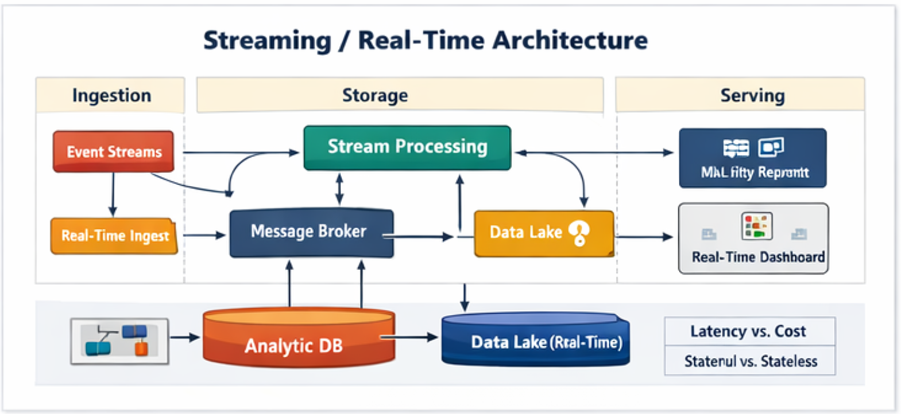

# Plataforma Moderna na GCP

GCP costuma ser escolhida quando a prioridade é:
- velocidade com simplicidade operacional
- time mais enxuto
- stack mais integrada

↳ Você troca flexibilidade por produtividade.

---

## 📐 Diagrama Oficial (Streaming consciente)

---

## Componentes típicos (exemplo, não receita)

- **Cloud Storage**: landing/raw (quando aplicável)
- **BigQuery**: motor principal (armazenamento + processamento)
- **Orquestração**: Cloud Composer (Airflow gerenciado)
- **Governança**: IAM + Data Catalog/Dataplex (dependendo do caso)
- **BI**: Looker / Power BI

---

## O que GCP faz muito bem

- reduzir custo de operação de infraestrutura
- acelerar ciclos analíticos (SQL-first)
- escalar sem tuning constante

---

## Trade-offs que líderes precisam saber

- maior dependência do ecossistema GCP
- portabilidade menor em cenários multi-cloud
- decisões importantes “escondidas” no serverless (custo pode surpreender)

---

## Quando GCP é a escolha certa

- time pequeno e muita demanda
- foco em agilidade e time-to-value
- empresa quer simplificar operação
- prioridade em analytics rápido

---

## 🔜 Próximo tópico

➡️ Continue para: [Trade-offs Arquiteturais](./tradeoffs-arquitetura.md)
