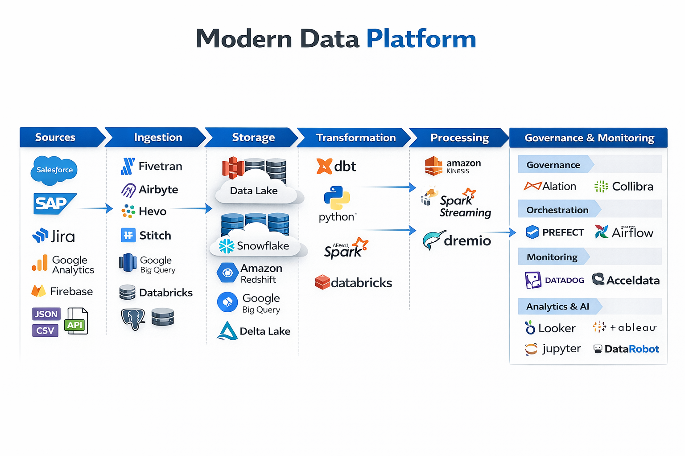

# Arquitetura

Este capítulo transforma visão em estrutura técnica **orientada a decisões**.

Aqui você encontra:
- Arquitetura de referência (plataforma, não stack)
- Exemplos por cloud (AWS e GCP)
- Trade-offs que líderes precisam saber defender
- Anti-patterns que derrubam plataformas em produção

---

## 📌 Como usar este capítulo

1- Comece pela **Arquitetura de Referência**  
2- Compare AWS vs GCP como exemplos (ferramenta é contexto)  
3- Leia os trade-offs para aprender a justificar decisões

---

## 📂 Conteúdo

1. [Arquitetura de Referência](1-arquitetura-de-referencia.md)
2. [Lakehouse na AWS](2-lakehouse-aws.md)  
3. [Plataforma Moderna na GCP](3-plataforma-moderna-gcp.md)  
4. [Trade-offs Arquiteturais](4-tradeoffs-arquitetura.md)

---

#### 💡Principais ferremantas e recursos envolvidos
---

## 🔜 Próximo Capítulo

- [2-Ingestão](../2-ingestao)
