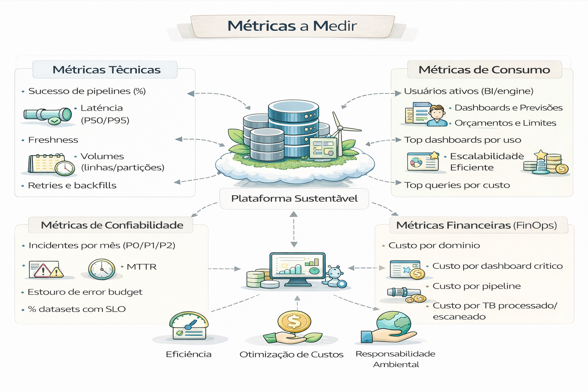

# Métricas de Plataforma (o que medir)

Se você mede errado, você otimiza errado.

As métricas em uma Modern Data Platform (Plataforma de Dados Moderna) são divididas em camadas para garantir que a infraestrutura seja eficiente, os dados sejam confiáveis e o negócio extraia valor real.

---

---

Diferente de arquiteturas legadas, o foco aqui é a observabilidade e a agilidade. 

### 1. Métricas de Observabilidade e Qualidade (Data Reliability)

Essenciais para garantir que os dados não estejam "quebrados" antes de chegarem ao usuário final.

- Data Downtime: Período em que os dados estão ausentes, errôneos ou desatualizados. É calculado como: Número de incidentes × (Tempo médio de detecção + Tempo médio de resolução).

- As 6 Dimensões da Qualidade:

    - Completude: Percentual de dados obrigatórios preenchidos.
    - Atualidade (Freshness): Tempo decorrido desde a última atualização do dado.
    - Precisão: O quanto o dado reflete a realidade.
    - Consistência: Se os dados são iguais em diferentes sistemas.
    - Validade/Conformidade: Se seguem o formato esperado (ex: datas, CPFs).
    - Integridade: Existência de relações válidas entre tabelas (sem registros "órfãos"). 

### Métricas de Engenharia e Performance (Data Ops)

Focam na eficiência dos pipelines e no custo da infraestrutura. 

- Tempo de Ingestão e Processamento: Rapidez com que o dado bruto se torna utilizável.

- Taxa de Sucesso de Pipelines: Percentual de execuções de ETL/ELT concluídas sem erros.

- Custo por Consulta/Processamento: Monitoramento de gastos elásticos em ferramentas como Snowflake ou BigQuery.

- Performance de Consultas: Monitoramento de relatórios lentos que podem indicar necessidade de otimização. 

### 3. Métricas de Valor de Negócio (KPIs)

O objetivo final da plataforma é mover ponteiros de negócio.

- Adoção e Uso: Quantos usuários únicos acessam os dashboards e com que frequência.

- ROI de Dados: Impacto financeiro gerado pelas decisões baseadas na plataforma (ex: redução de Churn ou aumento de Ticket Médio).

- Time-to-Market de Novos Dados: Tempo médio para que uma nova fonte de dados solicitada pelo negócio esteja disponível para análise.

4. Métricas de IA e Modern Stack (GenAI)

Para plataformas que já integram IA generativa. 

- Latência do Modelo: Tempo de resposta das APIs de IA.

- Taxa de Erros/Alucinações: Frequência de respostas tecnicamente incorretas ou fora de contexto.

- Custos de Token/Inferência: Monitoramento do gasto com modelos de linguagem (LLMs). 

--- 

Para gerenciar tudo isso, ferramentas de Observabilidade de Dados (como a Monte Carlo) e catálogos de dados são fundamentais para centralizar esses indicadores.

---

## Métricas técnicas

- Sucesso de pipelines (%)
- Latência (P50/P95)
- Freshness
- Volumes (linhas/partições)
- Retries e backfills

---

## Métricas de consumo

- Usuários ativos (BI/engine)
- Queries por domínio
- Top dashboards por uso
- Top queries por custo

---

## Métricas de confiabilidade

- Incidentes por mês (P0/P1/P2)
- MTTR
- Estouro de error budget
- % datasets com SLO

---

## Métricas financeiras (FinOps)

- Custo por domínio
- Custo por dashboard crítico
- Custo por pipeline
- Custo por TB processado/escaneado

---

## 🔜 Próximo

➡️ [FinOps em Dados](./05-finops-em-dados.md)
