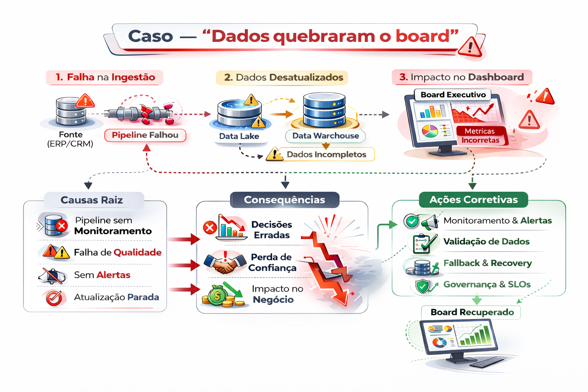

# Caso — “Dados quebraram o board”

O cenário em que "dados quebraram o board" (conselho de administração) em uma Modern Data Platform descreve uma falha crítica onde, apesar da tecnologia moderna e cara (Modern Data Stack), a falta de governança e qualidade dos dados gerou decisões erradas ou perda de confiança da alta liderança.

--- 

--- 

Embora não haja um único "caso" público com esse nome exato nos resultados, o padrão descrito é comum e reflete os seguintes pontos levantados na pesquisa:

### O Quebra-Cabeça da Falha (O Caso "Dados Quebraram o Board")

- 1- A falsa sensação de segurança: A empresa investiu em nuvem, ferramentas de ETL modernas (como Fivetran/Airbyte) e warehouses escaláveis (Snowflake/Databricks), criando uma "Modern Data Platform". No entanto, o foco foi apenas na tecnologia e não na governança.

- 2- Dados como Passivo: Em vez de ativos, os dados tornaram-se passivos. Dados inconsistentes, incompletos ou mal definidos na plataforma moderna levaram a previsões de receita erradas ou KPIs de performance incorretos apresentados ao conselho.

- 3- O "Board" sem confiança: Quando a diretoria percebeu discrepâncias profundas entre o dashboard moderno e a realidade financeira/operacional, a confiança na área de dados foi destruída. A frase "dados quebraram o board" significa que a confiança foi tão abalada que a governança da empresa foi questionada.

- 4- Causas raiz:

    - Falta de Data Governance: Ausência de controle sobre quem insere e altera os dados.
    - Foco na Velocidade, não na Qualidade: A agilidade da nuvem permitiu que dados ruins fossem distribuídos mais rapidamente.
    - Desconexão Negócio-TI: As métricas definidas pelo board não eram as mesmas implementadas tecnicamente. 

### Consequências de um "Board Quebrado" por Dados

- Decisões estratégicas erradas: Investimentos baseados em métricas falsas (ex: valor de cliente, custo de aquisição).

- Perda de reputação e valor: Questionamento dos investidores e do mercado sobre a capacidade de gestão.

- Atraso na transformação digital: A empresa retrocede, perdendo a confiança em dados para tomar decisões e voltando a depender de "feeling".  

### Como Evitar (Modern Data Platform com Governança)

- DataOps e Governança: Implementar governança de dados desde o dia zero da plataforma moderna.

- Qualidade em primeiro lugar: Testes automatizados de dados (Data Quality Checks) antes que os dados cheguem aos dashboards da diretoria.

- Definição de métricas: Garantir que o conselho e o time de dados falem a mesma língua (data dictionary/glossário).

## Sintomas de que está ocorrendo na empresa

Reunião executiva com números errados ou dashboard indisponível.

### Causa típica
- pipeline atrasado
- mudança de schema sem aviso
- falta de SLO e monitoramento

### Intervenção de plataforma
1. Definir SLO para o ativo crítico
2. Alertar antes da reunião (freshness/latência)
3. Playbook: rollback/último snapshot válido
4. Postmortem + prevenção (contratos/testes)
5. Comunicação executiva objetiva

### Resultado esperado
- confiança recuperada
- menos incidentes P0

### Conclusão
Para manter o board "vivo", plataformas modernas agora focam em Data Observability (ferramentas como Monte Carlo ou de linhagem de dados) para detectar pipelines quebrados antes que o usuário final perceba no dashboard

## 🔜 Próximo

➡️ [CI/DC DataOps](../11-ci-cd-dataops)
