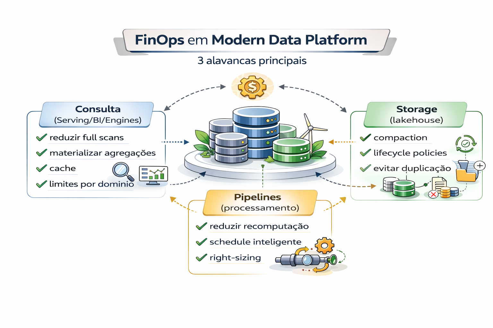

# FinOps em Dados (modelo prático)

FFinOps é disciplina para transformar custo em decisão.

Objetivo:
**evitar que consumo e processamento virem caixa-preta financeira.**

---

FinOps em uma Modern Data Platform (Plataforma de Dados Moderna) é a prática de gerenciar os custos variáveis de nuvem e ferramentas SaaS (como Snowflake, Databricks, BigQuery) para garantir que cada centavo investido em dados gere valor real ao negócio. 

Diferente da infraestrutura tradicional, onde os custos são baseados em servidores ligados, em plataformas de dados modernas os gastos são impulsionados por consumo volátil (consultas SQL, pipelines de ETL, processamento de IA e volume de dados escaneados). 

---

### Pilares de Implementação

O framework segue o ciclo de vida da FinOps Foundation: 

- Informar (Visibility): Criar dashboards que permitam ver o custo por consulta, por time ou por produto de dados. É fundamental usar tags e metadados para identificar quem disparou cada processo.

- Otimizar (Optimization): Identificar desperdícios, como tabelas nunca consultadas ou queries mal escritas que escaneiam TBs desnecessariamente. Aqui aplicam-se técnicas como auto-suspend de warehouses inativos e rightsizing de clusters.

- Operar (Operation): Incorporar a responsabilidade financeira no dia a dia dos engenheiros de dados e analistas. O custo passa a ser uma métrica de performance tão importante quanto a latência.

### KPIs Essenciais para Dados

Para medir o sucesso, as empresas utilizam métricas de Unit Economics: 

- Custo por Consulta (Query): Quanto custa rodar um relatório específico.

- Storage Decay Ratio: Custo de dados armazenados que não são acessados há mais de 90 dias.

- Computational Waste: Créditos consumidos por jobs que falharam ou re-processamentos desnecessários.

- Data Value Density: Comparação entre o custo do produto de dados e a receita que ele ajuda a gerar. 

### Desafios Específicos

- Moedas Virtuais: Plataformas como Snowflake e Databricks usam "créditos" ou "DBUs", o que exige converter o uso técnico em valor monetário para o financeiro entender.

- Recursos Compartilhados: Quando várias áreas usam o mesmo Data Warehouse, a alocação precisa ser feita via metadados de execução, não apenas por tags de infraestrutura.

---

## 3 alavancas principais

---

## Modelo de gestão

1. Visibilidade: custo por domínio/consulta/pipeline
2. Orçamento: limites e alertas
3. Otimização: backlog mensal de economia
4. Políticas: gates para workloads caros
5. Relato executivo: KPIs e tendências

---

## 🔜 Próximo

➡️ [FinOps + Governança](6-finops-governanca.md)
