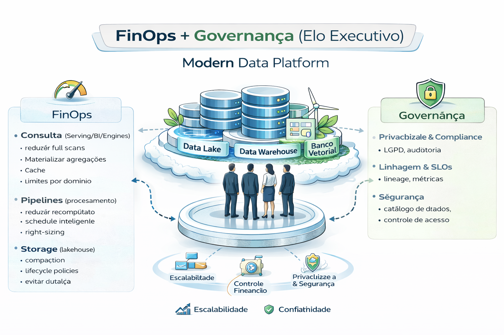

# FinOps + Governança (elo executivo)

Governança controla risco.
FinOps controla custo.
Observabilidade controla confiabilidade.

---

---

Para uma Modern Data Platform (MDP), o elo executivo entre FinOps e Governança é o que transforma dados de um "centro de custo" em um "motor de valor". 

### 1. O Elo Executivo: Alinhamento Estratégico

- A liderança não busca apenas redução de gastos, mas eficiência unitária (quanto custa cada insight gerado). O FinOps fornece a visibilidade financeira, enquanto a Governança garante a integridade e conformidade dos dados que justificam esse investimento. 

- Decisões Baseadas em Valor: Executivos usam o FinOps Framework para equilibrar velocidade, custo e qualidade.

- Responsabilidade Compartilhada: A governança estabelece as políticas; o FinOps garante que cada "Data Owner" seja financeiramente responsável pelo processamento e armazenamento de seus ativos.

### 2. FinOps em Modern Data Platforms

Diferente da infraestrutura comum, plataformas de dados modernas (como Snowflake, Databricks ou BigQuery) têm custos variáveis e elásticos. 

- Fase Informar: Dashboards que mostram o custo por pipeline, tabela ou área de negócio.

- Fase Otimizar: Eliminação de dados "dark" (nunca usados) e ajuste de clusters de processamento.

- Fase Operar: Automação de alertas e orçamentos (Budgets) integrados ao ciclo de DataOps. 

### 3. Governança como Suporte ao FinOps
A Governança de Dados impede que o "lixo" seja processado, economizando recursos antes mesmo do gasto ocorrer. 

- Ciclo de Vida do Dado: Políticas de retenção e arquivamento que reduzem custos de armazenamento a longo prazo.

- Qualidade e Reuso: Dados bem governados evitam o reprocessamento desnecessário, um dos maiores "ralos" financeiros em MDPs.

---

## Modelo integrado

Classificação de dados
→ Política de acesso
→ Limites de consumo
→ Observabilidade (SLO/MTTR)
→ Auditoria (quem acessou + custo + impacto)

---

## KPI executivo que muda conversa

- Custo por domínio por nível de sensibilidade
- Incidentes P0/P1 por trimestre
- % datasets com SLO
- MTTR e error budget

---

## 🔜 Próximo

➡️ [Checklist 90 dias](7-checklist-90-dias.md)
