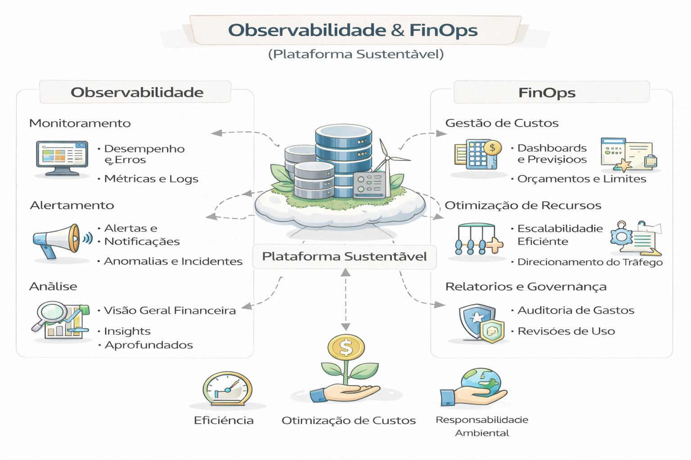
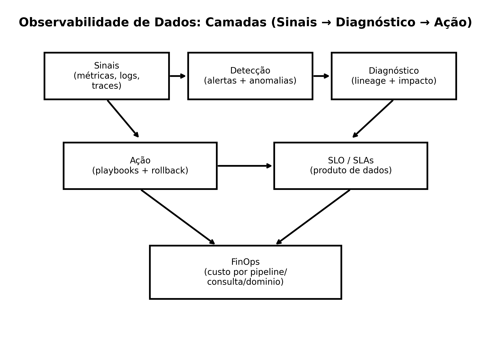
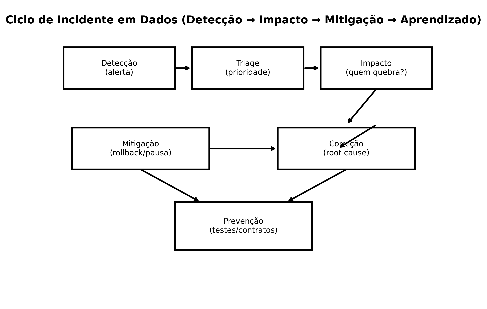
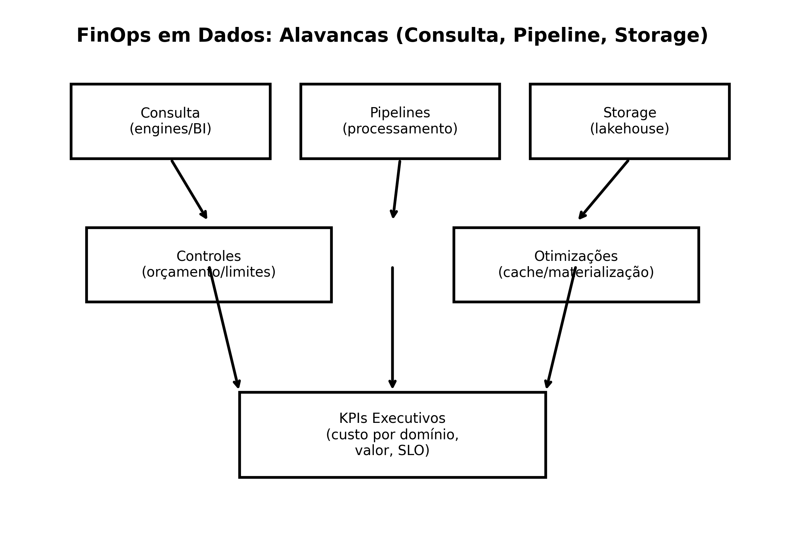

# 📈 10 - Observabilidade & FinOps (Plataforma Sustentável)

Observabilidade de dados e FinOps não são “extra”.
São o que separa plataforma **funcional** de plataforma **sustentável**.

Este capítulo conecta:
- Sinais (métricas/logs/traces)
- SLOs e confiabilidade
- Incidentes e playbooks
- FinOps por consulta, pipeline e domínio
- KPIs executivos e governança

---

---

## 📐 Diagramas deste capítulo

1. **Camadas de Observabilidade**  
   

2. **Ciclo de Incidente de Dados**  
   

3. **FinOps: Alavancas em Dados**  
   

---

## 📂 Conteúdo

1. [O que é Observabilidade de Dados](1-o-que-e-observabilidade.md)  
2. [SLOs e SLAs para Dados](2-slos-slas.md)  
3. [Incidentes: Triage, Impacto e Playbooks](3-incidentes-playbooks.md)  
4. [Métricas de Plataforma (o que medir)](4-metricas-plataforma.md)  
5. [FinOps em Dados (modelo prático)](5-finops-em-dados.md)  
6. [FinOps + Governança (elo executivo)](6-finops-governanca.md)  
7. [Checklist de Sustentabilidade (90 dias)](7-checklist-90-dias.md)  
8. [Estudo de Caso — “Custo explodiu”](8-caso-custo-explodiu.md)  
9. [Estudo de Caso — “Dados quebraram o board”](9-caso-incidente-board.md)

---

## 🔜 Próximo

- [11-CI/DC DataOps](../11-ci-cd-dataops)
