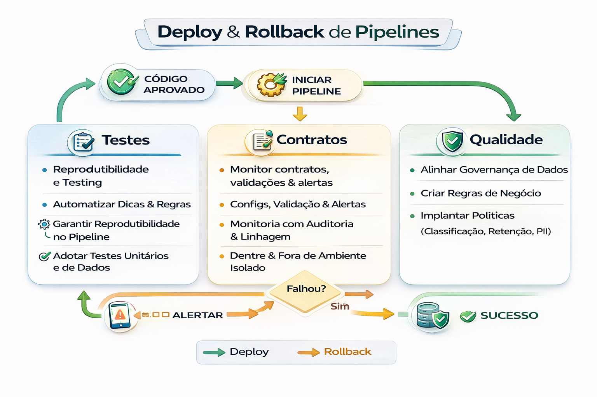

# Deploy & Rollback de Pipelines

Deploy em dados precisa ser reversível.

O Deploy e o Rollback são pilares de um pipeline de CI/CD (Integração e Entrega Contínuas) que garantem a entrega rápida de software sem comprometer a estabilidade do sistema

Porque:
- pipeline falha
- schema muda
- custo explode
- board quebra

---

---

### 1. Deploy de Pipelines

O deploy é o processo de implantar o código em um ambiente (teste, homologação ou produção). Em pipelines modernos, ele é automatizado para reduzir erros manuais e acelerar o Time-to-Market. 

- Principais Estratégias de Deploy:

    - Rolling Update: Substitui instâncias da versão antiga pela nova de forma gradual, evitando downtime.
    - Blue-Green: Mantém dois ambientes idênticos; o tráfego é direcionado do antigo (Blue) para o novo (Green) após validação.
    - Canary Deployment: Libera a nova versão para um pequeno grupo de usuários antes da escala total. 

### 2. Rollback de Pipelines

O rollback é a reversão estratégica para um estado funcional anterior quando uma falha é detectada após o deploy. É uma "rede de segurança" essencial para a resiliência do sistema. 

- Como implementar o Rollback:

    - No Kubernetes: Utiliza o histórico de revisões de um Deployment para retornar rapidamente a um ReplicaSet estável.
    - No Git: Comandos como git revert (cria um novo commit que desfaz alterações) ou git reset (move a branch para um estado anterior) são fundamentais.
    - Automático: Ferramentas como ArgoCD ou plugins no Helm podem disparar a reversão se testes de saúde (health checks) falharem logo após o deploy.
    - Banco de Dados: Envolve o uso de transações SQL (ROLLBACK) ou ferramentas de versionamento de banco como o Liquibase para desfazer mudanças de esquema. 

### 3. Ferramentas Populares

Para gerenciar esses fluxos, as ferramentas mais comuns incluem:

- Orquestração: Jenkins, GitHub Actions, GitLab CI/CD e Azure DevOps.

- Infraestrutura e Containers: Docker, Kubernetes e Terraform. 

## Estratégias de rollback

- **Rollback de código**: reverter commit/tag
- **Rollback de dados**: snapshot/time travel
- **Rollback de schema**: migrações reversíveis
- **Fallback**: último dataset válido

---

## Playbook mínimo (P0)

1. Pausar propagação
2. Restaurar último estado válido
3. Comunicar impacto
4. Postmortem
5. Ação preventiva (gate novo)

---

## 🔜 Próximo

➡️ [GitHub Actions Base](./06-github-actions-base.md)
