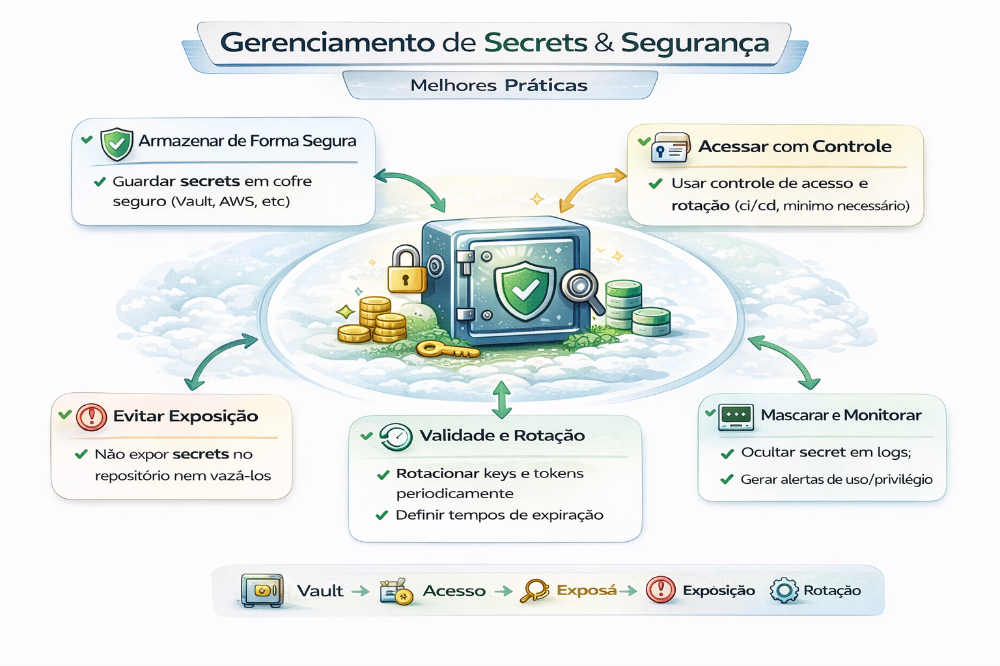

# Gerenciamento de Secrets e Segurança

Regra de ouro:
**se está no repo, já vazou.**

O gerenciamento de secrets (segredos) no GitHub é essencial para evitar a exposição de dados sensíveis, como chaves de API e senhas, em repositórios de código

---

---

### 1. Níveis de Armazenamento

O GitHub permite organizar segredos em três camadas principais: 

- Organization Secrets: Compartilhados entre múltiplos repositórios de uma organização, facilitando a padronização.

- Repository Secrets: Específicos para um único repositório, ideais para projetos isolados.

- Environment Secrets: Vinculados a ambientes específicos (ex: dev, prod). Permitem controles extras, como a necessidade de aprovação manual de um revisor antes do segredo ser liberado para o workflow. 

### 2. Recursos de Segurança Automática

- Secret Scanning: O GitHub vasculha o histórico de commits em busca de segredos expostos. É gratuito para repositórios públicos e disponível no GitHub Advanced Security para privados.

- Push Protection: Impede que um desenvolvedor envie (push) um commit que contenha segredos detectados antes mesmo de chegarem ao servidor. 

### 3. Melhores Práticas

- Princípio do Privilégio Mínimo: Conceda apenas as permissões necessárias para cada segredo.

- Evite Logs: O GitHub mascara segredos em logs do Actions, mas você nunca deve imprimi-los intencionalmente (ex: echo $SECRET).

- Use OIDC (OpenID Connect): Para conexões com nuvens (AWS, Azure, GCP), prefira o OIDC para eliminar a necessidade de armazenar segredos de longa duração no GitHub.

- Rotação Periódica: Troque suas chaves regularmente e imediatamente após qualquer suspeita de vazamento.

## Boas práticas

- usar GitHub Secrets / Vault / Secret Manager
- rotacionar credenciais
- princípio do menor privilégio (IAM)
- separar credenciais por ambiente (DEV/STG/PROD)
- logs sem dados sensíveis (redaction)

---

## Anti-patterns

- `.env` commitado
- chave em notebook
- credencial compartilhada por time
- token com acesso total

---

## 🔜 Próximo

➡️ [Release e Versionamento](./08-release-versionamento.md)
