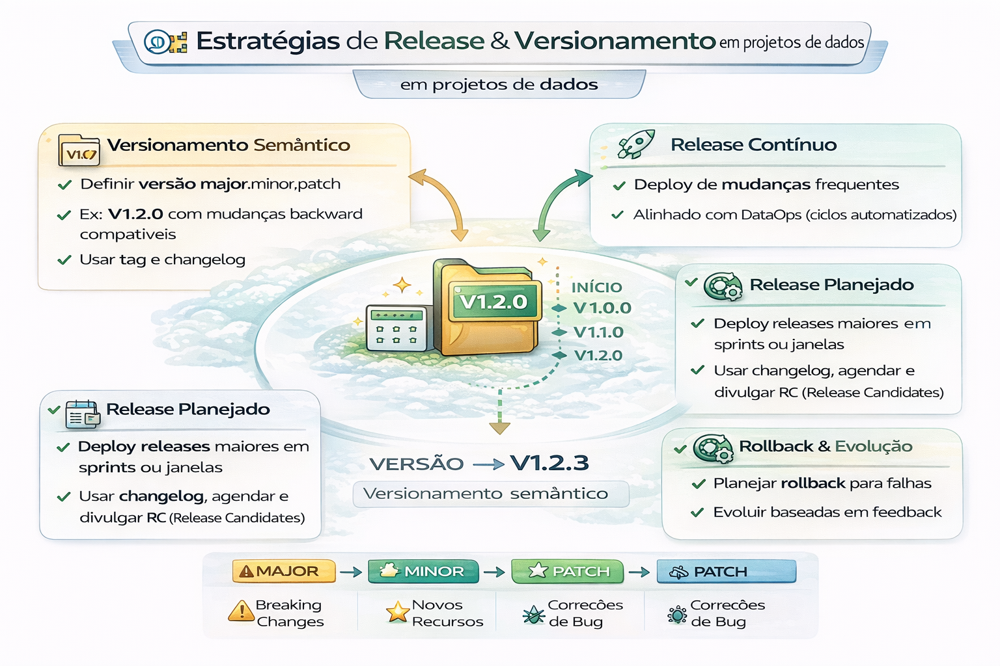

# Estratégias de Release e Versionamento

Release é como você dá previsibilidade para mudança.

Estratégias de release e versionamento em projetos de dados diferem do software tradicional por envolverem três componentes distintos: código (pipelines)infraestrutura (DW/Databricks) e dados/modelos (volume e esquema). A aplicação de práticas DataOps é fundamental para garantir a reprodutibilidade, qualidade e agilidade.

Para projetos de dados, as estratégias de release e versionamento precisam lidar com três pilares: o código das pipelines, os metadados (esquemas) e os próprios dados (volumes massivos que não cabem no Git tradicional).

---

--- 

### 1. Versionamento de Código e Pipelines

Utiliza-se o fluxo de software padrão, mas adaptado para a natureza sequencial dos dados: 

- GitFlow ou GitHub Flow: Estratégias de ramificação (branching) para isolar o desenvolvimento de novas features e correções rápidas (hotfixes) antes da fusão na branch principal.

- Commits Semânticos: Uso de mensagens padronizadas (ex: feat:, fix:) para facilitar a geração automática de logs de release. 

    - MAJOR: Alterações estruturais que quebram a compatibilidade (ex: mudar o tipo de dado de uma coluna, renomear colunas essenciais, remover dados).
    - MINOR: Adição de funcionalidades ou dados compatíveis (ex: adicionar uma nova coluna ao final de uma tabela, novas fontes de dados que não alteram o histórico).
    - PATCH: Correções de bugs sem alterar a estrutura (ex: reprocessamento de dados errados, correções de valores nulos).

### 2. Versionamento de Dados e Modelos

Arquivos grandes e datasets exigem ferramentas que gerenciam ponteiros, evitando sobrecarregar o repositório: 

- DVC (Data Version Control): Funciona como um "Git para dados", rastreando versões de arquivos grandes armazenados em S3, GCS ou Azure, permitindo reproduzir experimentos e pipelines com precisão.

- LakeFS: Oferece operações semelhantes ao Git (branch, merge, commit) diretamente sobre o Data 

- Versionamento de Dados e Esquemas (Schema Versioning): Utilize ferramentas para rastrear o esquema da tabela ao longo do tempo (ex: DBT``Delta Lake``Apache Iceberg). Isso garante que um pipeline antigo possa ler dados antigos e o novo pipeline leia dados novos.

- Versionamento de Modelos de ML: Use ferramentas como MLflow ou DVC (Data Version Control) para versionar não apenas o código, mas o conjunto de dados usado no treinamento e o modelo resultante (artifacts). 

### 3. Estratégias de Release (Deployment)

Diferente de software comum, releases de dados focam na integridade e retrocompatibilidade dos esquemas: 

- Gitflow Adaptado: Utilize main (produção)develop (staging/integração) e branches de feature para desenvolvimento. Pipelines de dados devem ser testados em ambientes de staging idênticos à produção.

- Implantação Automatizada (CI/CD): Automatize os testes e a implantação de pipelines usando ferramentas como GitHub Actions, GitLab CI ou Azure DevOps. Isso reduz erros humanos em migrações de banco de dados e atualizações de DAGs (Airflow).

- Dark Launch/Feature Flags: Para mudanças grandes em pipelines de ETL, utilize feature flags para habilitar a nova lógica de dados para um subconjunto de usuários ou cenários, garantindo reversão imediata (rollback) se a integridade do dado for comprometida.

- Blue-Green Deployment para Dados: Mantenha dois ambientes de produção ativos. O pipeline atualiza o ambiente "Green" (inativo) enquanto o "Blue" (ativo) atende aos usuários. Após validar os dados no "Green", a chave é alternada.

### 4. Gestão de Mudanças de Esquema (Schema Evolution)

- Versionamento Semântico (SemVer): Aplicado a tabelas e APIs. Mudanças que quebram a compatibilidade (ex: remover colunas) exigem incremento da versão MAJOR.

- Contratos de Dados: Uso de ferramentas para garantir que mudanças no produtor de dados não quebrem os consumidores (downstream). 

- Validação de Dados no Release: Cada release deve conter etapas automáticas de Data Quality (ex: Great Expectations``DBT tests). Se o pipeline de release 2.0 produzir dados nulos ou fora do esperado, o deploy falha automaticamente.

- Rollback Planejado (Backout Plan): Todo release de dado deve ter uma estratégia de reversão. Se uma tabela foi atualizada incorretamente, o sistema deve ser capaz de voltar ao esquema e conteúdo anteriores.

- Documentação e Release Notes: Documente as mudanças no esquema, novas fontes e impacto no Downstream (consumidores dos dados)

### Recomendação madura

- tags semânticas (v1.2.0)
- changelog (o que mudou)
- “breaking changes” explícitas
- migrações versionadas

---

### Quando “quebra” em dados?

- mudança de schema
- mudança de regra de negócio
- mudança de granularidade
- mudança de janela temporal

Isso precisa de versionamento.

## Resumo

| Componente      | Ferramentas Sugeridas                                          |
|-----------------|----------------------------------------------------------------|
| Código/DAGs     | Git, GitHub, GitLab                                            |
| Dados/Esquema   | DBT, Delta Lake, Apache Iceberg, DVC                           |
| Modelos ML      | MLflow, DVC, SageMaker Model Registry                          |
| Qualidade       | Great Expectations, Soda                                       |
| CI/CD           | Airflow (para orquestração), GitHub Actions                    |

Ao adotar essas estratégias, os projetos de dados tornam-se reprodutíveis, permitindo que cientistas e engenheiros de dados trabalhem em paralelo sem quebrar o ambiente de produção.

## 🔜 Próximo

➡️ [Checklist DataOps](09-checklist-dataops.md)

