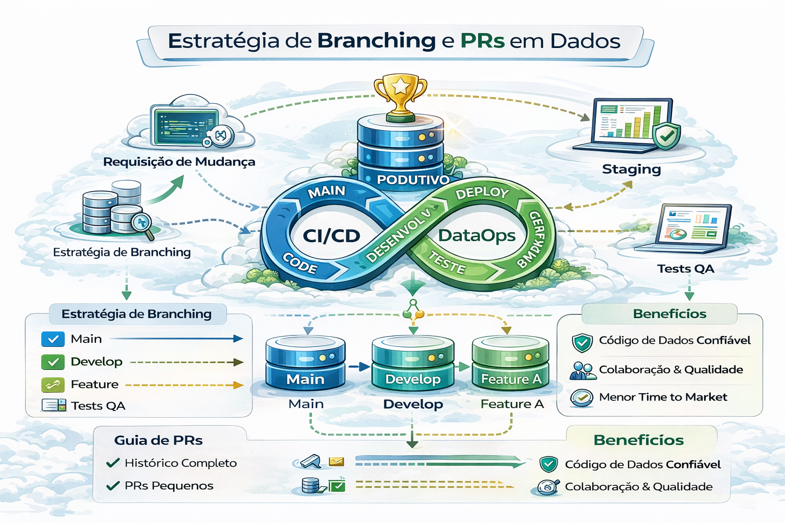

# Branching e PRs em Projetos de Dados

Branching é governança de mudança.

Uma estratégia de branching (ramificação) e Pull Requests (PRs) eficiente é o pilar do DataOps, garantindo que mudanças em pipelines de dados, modelos dbt ou scripts ETL sejam rastreáveis, testadas e seguras antes de impactar a produção.
A abordagem ideal combina isolamento do ambiente de desenvolvimento com integração contínua (CI). 

---

---

### Estratégias de Branching em Dados (Branching Models)

- 1- Feature Branch Workflow (Recomendado):

    - Como funciona: Uma branch principal (main ou master) representa a produção. Cada nova funcionalidade, transformação de dados ou correção é feita em uma branch separada (feature/nome-da-tabela ou fix/erro-pipeline).

    - Fluxo: feature -> PR -> main.

    - Vantagem: Isolamento total do trabalho, permitindo múltiplos engenheiros de dados trabalharem simultaneamente sem quebrar o ambiente principal.

- 2- GitFlow (Para ambientes complexos):

    - Como funciona: Utiliza branches de longa duração: main (produção)develop (integração) e feature/hotfix (curta duração).

    - Data Ops: Ideal quando há release agendada de novos dashboards ou modelos de dados complexos, separando desenvolvimento (dev) de pré-produção (staging).

- 3- Trunk-Based Development (Para alta maturidade):

    - Como funciona: Todos os desenvolvedores fazem merge frequente em uma única branch principal (main).

    - Data Ops: Exige automação de testes extrema (CI) e o uso de feature flags para ocultar dados em produção ainda não finalizados. 

### Estrutura e Nomenclatura (Boas Práticas)

- Proteger a main/prod: Nunca comitar diretamente na branch de produção. Use "Branch Protection Rules" para exigir revisões (PRs) e aprovações.

- Convenção de nomes:

    - feature/adiciona-tabela-vendas

    - fix/correcao-pipeline-etl

    - feat/dbt-dim-cliente

- Ciclo de vida curto: Branches de funcionalidade devem viver pouco tempo para evitar grandes conflitos de merge (merge hell). 

### Pull Requests (PRs) e Code Review em Dados 

O PR é onde a validação ocorre antes da fusão (merge). 

- 1. CI/CD na PR:

Ao criar uma PR, o sistema (GitHub Actions, GitLab CI, Azure DevOps) deve rodar:

    - Linting: Verificar estilo de SQL ou Python (ex: sqlfluff).
    - Testes de dados: Rodar dbt test em um ambiente de sandbox para garantir que a mudança não quebra a qualidade (ex: tabelas nulas, chaves primárias duplicadas).

- 2. Code Review:

    - Verificar a lógica da transformação SQL ou script Python.
    - Avaliar se a mudança causa impacto no desempenho da query.

- 3. Ambiente de "Staging":

    - Idealmente, a PR deve permitir a visualização de dados de amostra ou a criação de tabelas temporárias (schemas de desenvolvimento) para validação real pelo analista/engenheiro.

### Diferenças no Mundo de Dados

- Os dados são estado: Diferente de software convencional, um merge de código pode quebrar dados. Por isso, a verificação em um ambiente de staging ou sandbox antes da main é crítica.

- Merge incondicional: Git faz o merge de todos os arquivos. No dbt, por exemplo, o ideal é cada desenvolvedor ter seu próprio schema de desenvolvimento (dev_nome) para evitar sobreposição de tabelas.

- Rollbacks: Se o merge quebrar a produção, a estratégia de branch deve prever um git revert rápido para restaurar o estado estável da branch main. 

## Resumo: 

Use Feature Branches para desenvolvimento, exija PRs com testes automatizados (CI) e proteja a branch de produção. 

- Recomendação simples e madura:

    - `main`: produção
    - `develop` (opcional): integração
    - `feature/*`: mudanças
    - `hotfix/*`: correções urgentes

---

- PR bem feito (o mínimo)

    - descrição do que muda e por quê
    - impacto esperado
    - plano de rollback
    - evidência de testes
    - checklist de qualidade

---

## Templates que elevam autoridade

- PR template com: risco, impacto, rollback, owner
- checklist obrigatório para datasets críticos
- exigência de 1-2 revisores (CODEOWNERS)

---

## 🔜 Próximo

➡️ [Ambientes e Promoção](3-ambientes-e-promocao.md)
