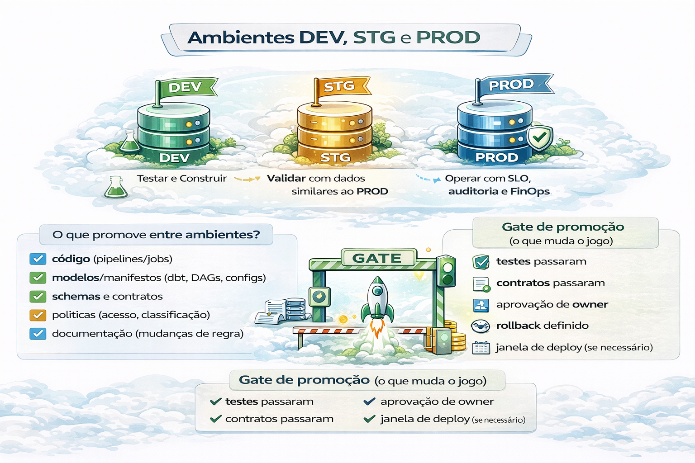

# Ambientes e Promoção (DEV → STG → PROD)

Sem ambientes, você não tem “plataforma”.
Você tem “deploy direto no cliente”.

A separação de ambientes de dados em Desenvolvimento (DEV), Homologação/Staging (STG) e Produção (PROD) é uma prática essencial para garantir a integridade, segurança e qualidade dos pipelines de dados e das informações finais.
O processo de promoção consiste em mover códigos, configurações eàs vezes, dados estruturados de um ambiente para outro após a validação, evitando falhas em produção

---

### 1. Ambientes de Dados

- DEV (Desenvolvimento):

    - Foco: Criação de novos pipelines, tabelas e scripts.
    - Dados: Utiliza subconjuntos de dados (samples) ou dados sintéticos para simular cenários sem expor dados reais.
    - Acesso: Livre para os engenheiros de dados. O objetivo é a produtividade.

- STG (Staging/Homologação/QA):

    - Foco: Validação de ponta a ponta (funcional e não funcional).
    - Dados: Utiliza uma cópia mais fiel dos dados de produção, mas anonimizada (PII Masking) para segurança.
    - Objetivo: Garantir que o pipeline funciona com volumes de produção e regras de negócio antes do deploy final.

- PROD (Produção):

    - Foco: Onde os dados finais são consumidos por dashboards, relatórios e sistemas operacionais.
    - Dados: Dados reais e críticos.
    - Acesso: Restrito. Alterações exigem aprovação e rigoroso controle. 

### 2. Fluxo de Promoção de Dados (Pipeline)

A promoção de dados deve ser automatizada através de pipelines CI/CD (Integração e Entrega Contínuas). 

- 1- Desenvolvimento (Git Branch): O engenheiro cria novas ETLs/dbt models em uma branch.

- 2- Pull Request (PR) e Testes (DEV -> STG):

    - 1. O código é mergeado para uma branch de staging.
    - 2. Testes unitários e de qualidade de dados (ex: dbt test``Great Expectations) são executados.
    - 3. Os dados são transformados em um ambiente de stage.

- 3- Homologação (Testes QA/User Acceptance):

    - 1. Validadores (analistas/negócios) verificam se os números condizem com a realidade.
    - 2. Testes de performance de carga são realizados.

- 4- Produção (STG -> PROD):

    - 1. O código validado é promovido para a branch principal (main/prod).
    - 2. A orquestração (ex: Airflow) aciona os novos jobs no ambiente de produção.
    - 3. Logs e monitoramento são ativados para detectar falhas imediatamente. 

### 3. Boas Práticas na Gestão de Dados entre Ambientes

- Separação de Infraestrutura: Use contas/projetos de nuvem diferentes (ex: AWS Account/GCP Project separados para DEV e PROD) para evitar que um job de desenvolvimento apague dados reais.

- Controle de Acesso (RBAC): Engenheiros não devem ter permissão de escrita em tabelas de produção.

- Parameterização: Utilize parâmetros no código para que o mesmo script funcione apontando para o banco de dados/schema correto (dev_db, stg_db, prod_db) sem alteração de código manual.

- Data Masking/Anonymization: Ao copiar dados de PROD para STG, garanta que dados sensíveis (LGPD/GDPR) sejam anonimizados.

- IaC (Infrastructure as Code): Utilize ferramentas como Terraform para garantir que a infraestrutura de STG seja idêntica à de PROD, evitando o problema de "funciona em STG, mas não em PROD". 

## Resumo 

---

## 🔜 Próximo

➡️ [Gates](4-gates-testes-contratos.md)
