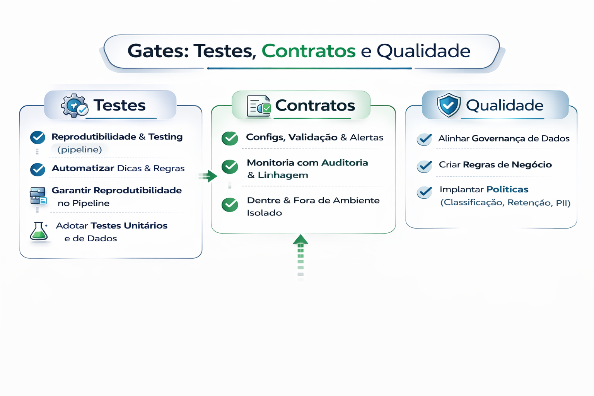

# Gates: Testes, Contratos e Qualidade

Gate é o que impede um PR de virar incidente.

Gates" (ou Quality Gates), Testes e Contratos de Dados são elementos fundamentais na engenharia de dados moderna para garantir a confiabilidade, integridade e qualidade dos dados ao longo de todo o pipeline, evitando o "lixo" na produção (garbage in, garbage out).

Para garantir a confiabilidade de um ecossistema de dados moderno, a integração entre Quality Gates, Testes e Data Contracts é essencial para mover a validação "para a esquerda" (shift-left), detectando erros antes que impactem o negócio

---

---

### 1. Data Contracts (O Acordo)

O Data Contract é um acordo formal entre produtores e consumidores que define a estrutura, semântica e expectativas de qualidade de um dataset. 

- O que contém: Esquema (nomes de colunas e tipos), frequência de atualização (SLA), restrições (ex: campos não nulos) e metadados de governança.

- Função: Atua como a "única fonte da verdade" para o que constitui um dado válido, permitindo a geração automática de validações e documentação. 

### 2. Testes de Dados (A Verificação)

Os testes operacionalizam o contrato. Eles não são apenas verificações pontuais, mas uma estratégia contínua: 

- Testes de Contrato de Esquema: Garantem que a estrutura dos dados (JSON, Avro, tabelas SQL) permanece consistente com o acordado.

- Check de Qualidade (DQ): Validam a integridade, completude e precisão (ex: garantir que um percentual esteja entre 0-100).

- Ferramentas: O dbt (data build tool) é amplamente utilizado para impor contratos de modelo durante a execução dos pipelines. 

### 3. Quality Gates (Os Pedágios)

Os Quality Gates são pontos de controle automáticos no pipeline onde o dado deve atender a critérios específicos para avançar. 

- Gate Crítico: Se o dado falha em uma regra essencial (ex: ID de usuário nulo), o pipeline é interrompido imediatamente (mecanismo de circuit breaker) para evitar a propagação de erro.

- Gate de Alerta: Se o dado desvia de padrões estatísticos (ex: anomalia no volume), o dado passa, mas um alerta é enviado para investigação. 

| Elemento       | Papel Principal | Exemplo Prático                                                       |
|----------------|-----------------|-----------------------------------------------------------------------|
| Data Contract  | Definição       | "O campo email deve ser uma string e nunca nulo."                     |
| Teste          | Execução        | `SELECT count(*) FROM table WHERE email IS NULL`                      |
| Quality Gate   | Decisão         | "Se o teste acima retornar > 0, interrompa a carga em Produção."      |

## Tipos de gate (Na Prática)

### 1) Qualidade do código
- lint + format
- testes unitários

### 2) Qualidade dos dados
- checks de volume (anomalias)
- checks de null/unique/range
- freshness

### 3) Contratos de dados
- schema esperado
- colunas obrigatórias
- tipos e invariantes

### 4) Segurança e compliance
- secrets nunca no repo
- scanning de vulnerabilidade
- acesso mínimo

---

## O ponto “senior”

Não é sobre ferramenta.
É sobre **política** e **responsabilidade**.

---

## 🔜 Próximo

➡️ [Deploy e Rollback](5-deploy-e-rollback.md)
