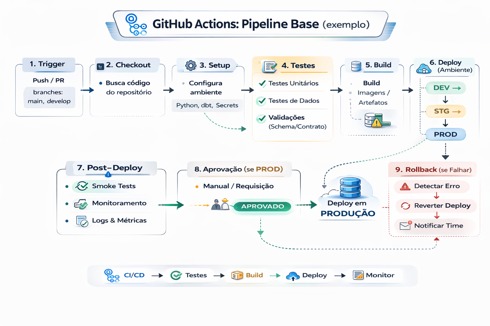

# GitHub Actions: Pipeline Base (exemplo)

Um pipeline base no GitHub Actions é um arquivo YAML localizado em .github/workflows/, que automatiza CI/CD (construção, testes e deploy) ao disparar ações com eventos como push ou pull request na main.

Essencial para automação, utiliza jobs e steps em ambientes virtuais como Ubuntu para garantir a qualidade do código.

---



---


Uma pipeline básica no GitHub Actions é definida por um arquivo .yml dentro da pasta .github/workflows/. 

Aqui está um exemplo essencial para testar e buildar um projeto:

```yaml
name: ci-dados
on:
  pull_request:
    branches: [ "main" ]

jobs:
  validar:
    runs-on: ubuntu-latest
    steps:
      - uses: actions/checkout@v4

      - name: Setup Python
        uses: actions/setup-python@v5
        with:
          python-version: "3.11"

      - name: Instalar dependências
        run: |
          pip install -r requirements.txt

      - name: Lint
        run: |
          ruff check .

      - name: Testes
        run: |
          pytest -q
```

---

### Componentes Principais:

- on: Gatilhos que iniciam o workflow (push, pull request, agendamento).

- jobs: Conjunto de etapas executadas no mesmo servidor.

- steps: Tarefas individuais, como rodar comandos ou usar Actions prontas da comunidade. 


## Evolução (nível plataforma)

- adicionar job de “data checks” (staging)
- adicionar “contract checks”
- adicionar “build artifacts” (containers)
- adicionar “deploy” com aprovação de ambiente

---

## 🔜 Próximo

➡️ [Secrets e Segurança](7-secrets-e-seguranca.md)
