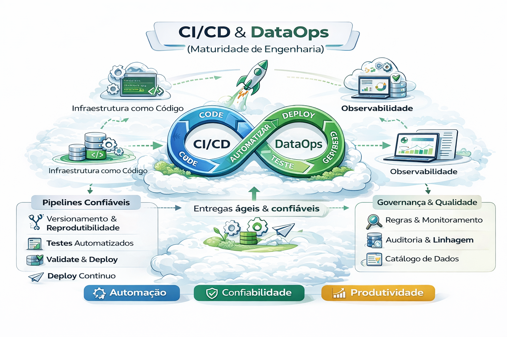

# 🚀 11 - CI/CD & DataOps (Maturidade de Engenharia)

Se você quer autoridade real em plataforma de dados, este capítulo é obrigatório.

O nível de maturidade em DataOps e CI/CD (Integração Contínua e Entrega Contínua) define o quanto uma equipe de engenharia de dados consegue entregar valor com velocidade e confiabilidade. Diferente do desenvolvimento de software tradicional, a maturidade aqui exige o controle não apenas do código, mas também da volatilidade dos dados e da infraestrutura. 

Aqui você aprende a tratar dados como software:
- PR, revisão, gates e releases
- Ambientes (DEV → STG → PROD)
- Testes e contratos como proteção
- Deploy e rollback de pipelines
- GitHub Actions (exemplos práticos)
- Segurança e secrets
- Integração com Observabilidade e FinOps (Cap. 10)

---

## 📐 Diagramas deste capítulo

1. **CI/CD para Dados (fluxo completo)**  
   

2. **Promoção entre Ambientes**  
   

3. **DataOps Loop**  
   

---

## 📂 Conteúdo

1. [O que é CI/CD para Dados](./01-o-que-e-cicd-para-dados.md)  
2. [Estratégia de Branching e PRs](./02-branching-e-prs.md)  
3. [Ambientes e Promoção (DEV→STG→PROD)](./03-ambientes-e-promocao.md)  
4. [Gates: Testes, Contratos e Qualidade](./04-gates-testes-contratos.md)  
5. [Deploy & Rollback de Pipelines](./05-deploy-e-rollback.md)  
6. [GitHub Actions: Pipeline Base](./06-github-actions-base.md)  
7. [Gerenciamento de Secrets e Segurança](./07-secrets-e-seguranca.md)  
8. [Estratégias de Release e Versionamento](./08-release-versionamento.md)  
9. [Checklist de DataOps (30/60/90)](./09-checklist-dataops.md)  
10. [Casos Reais: o que dá errado](./10-casos-reais.md)

---

## 🔜 Próximo

➡️ [Data Engineer](../0-visao-plataforma/README.md)12-cenarios-reais/
