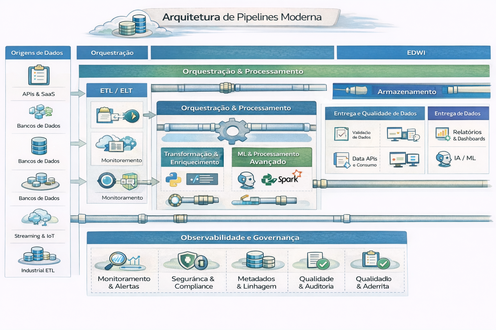

# Arquitetura de Pipelines 

Uma arquitetura de pipelines moderna refere-se a fluxos de trabalho otimizados e automatizados para processamento de dados ou entrega de software, focando em escalabilidade, agilidade e confiabilidade.

---

---

### 1. Arquitetura de Pipelines de Dados (Data Engineering)

Substitui o antigo modelo ETL (Extract, Transform, Load) rígido por abordagens mais flexíveis

- Arquitetura de Medalhão (Medallion Architecture): Popularizada pela Databricks, organiza os dados em camadas: Bronze (dados brutos), Silver (dados limpos/filtrados) e Gold (dados agregados para negócios).

- Processamento Híbrido: Integra processamento em lote (batch) para grandes volumes históricos e streaming em tempo real (usando Apache Kafka ou AWS Kinesis) para baixa latência.
Orquestração Moderna: Uso de ferramentas como Apache Airflow, Prefect ou Dagster para gerenciar dependências e monitorar falhas.

- Cloud-Native & Serverless: Armazenamento em Data Lakes (Amazon S3, Azure Data Lake) e computação elástica que escala conforme a demanda. 

### 2. Pipelines de CI/CD (Engenharia de Software)

Foca na automação completa desde o código até a produção. 

- Integração Contínua (CI): Testes automatizados (unidade, segurança) e builds disparados a cada commit.

- Entrega/Implantação Contínua (CD): Promoção automática do código para ambientes de homologação e produção com ferramentas como GitHub Actions ou Azure Pipelines.

- Observabilidade: Monitoramento em tempo real do status das execuções para rápida recuperação de falhas. 

### 3. Arquitetura de Processadores (Hardware)
Em um nível fundamental de computação, a técnica de pipeline divide a execução de instruções em estágios paralelos, aumentando drasticamente o desempenho de CPUs modernas (especialmente em arquiteturas RISC).

## Camadas Envolvidas

1. Ingestão (Batch / Streaming / CDC)
2. Camada Raw (imutável) 
3. Transformação versionada
4. Camada Serving
5. Camada Semântica

## Princípios avançados

- Idempotência real
- Replay completo
- Versionamento de datasets
- Data Contracts
- Observabilidade embutida

## Decisões técnicas críticas

- Quando usar Spark vs SQL distribuído
- Quando usar streaming real vs micro-batch
- Impacto de partições no custo

## Benefícios de uma implantação com sucesso

- Velocidade e Qualidade: Feedback rápido para desenvolvedores e deploys rápidos.
- Escalabilidade: Processamento de grandes volumes de dados (Big Data).
- Confiabilidade: Redução de falhas humanas com automação. 

---

## 🔜 Próximo

➡️ [Pipeline Distribuido Moderno](2-pipeline-distribuido-referencia.md)