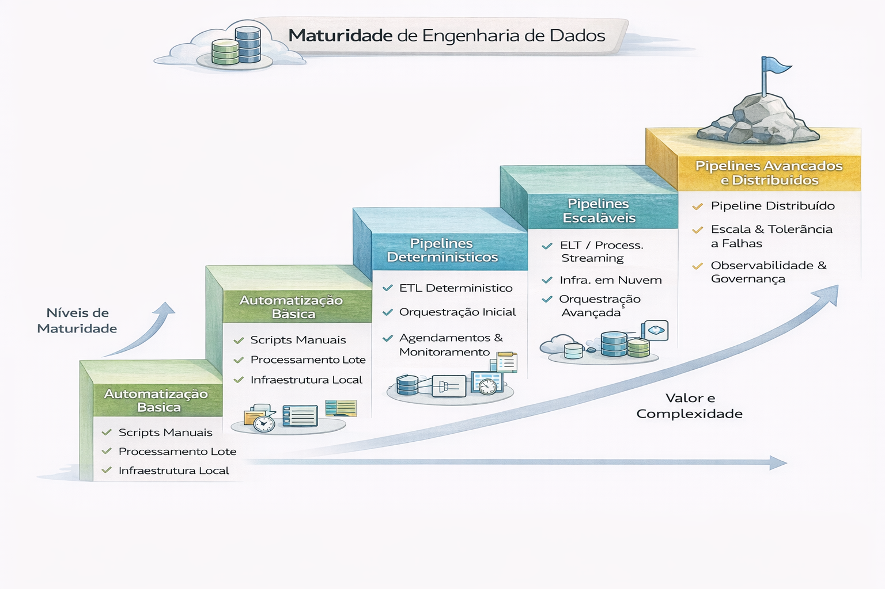

# Maturidade de Engenharia de Dados

A maturidade de engenharia de dados refere-se ao nível de sofisticação, eficiência e confiabilidade com que uma organização coleta, processa, armazena e disponibiliza dados para análise e tomada de decisão. Ela evolui de processos manuais e caóticos para sistemas automatizados, governados e orientados por dados

---

---

### Níveis Típicos de Maturidade de Dados

A evolução da maturidade geralmente segue etapas como:

- 1. Não Iniciado/Ad-hoc: Processos manuais, falta de padronização e documentação limitada.

- 2. Iniciado/Emergente: Práticas básicas de modelagem aplicadas a projetos específicos.

- 3. Desenvolvido/Padronizado: Processos formais, documentados e com governança estruturada.

-4. Otimizado/Estratégico: Cultura de dados consolidada, uso de automação, metadados gerenciados e dados como ativo estratégico.

### Principais Elementos da Maturidade

- Qualidade e Governança: Garantir dados confiáveis, seguros e em conformidade.

- Infraestrutura e Tecnologia: Uso de arquiteturas modernas (Data Lake, Data Warehouse) e ferramentas de automação (DevOps/MLOps).

- Cultura de Dados: Capacidade da organização de tomar decisões baseadas em análise de dados.

### Importância e Impacto

Apenas uma pequena parcela das empresas (cerca de 12%) alcança alta maturidade de dados. Organizações com alta maturidade digital, no entanto, podem crescer significativamente mais do que as de baixa maturidade.
O diagnóstico da maturidade é crucial para identificar áreas de fraqueza e planejar a evolução da gestão de dados. 

# Matriz de Maturidade de Engenharia de Dados

| Nível | Característica | Observabilidade | FinOps | Governança |
|-------|----------------|----------------|--------|------------|
| 1 - Inicial | Scripts manuais | Nenhuma | Não controlado | Manual |
| 2 - Estruturado | Pipelines automatizados | Logs básicos | Monitoramento parcial | Controle básico |
| 3 - Escalável | Sistemas distribuídos | Métricas + Alertas | Custo por pipeline | IAM estruturado |
| 4 - Plataforma | Data Contracts | SLO definidos | Custo por domínio | Governança ativa |
| 5 - Enterprise | Arquitetura modular | Observabilidade preditiva | Otimização contínua | Modelo federado |

---
## 🔜 Próximo

➡️ [Engenharia de Dados + Finops](4-engenharia-finops-observabilidade.md)

