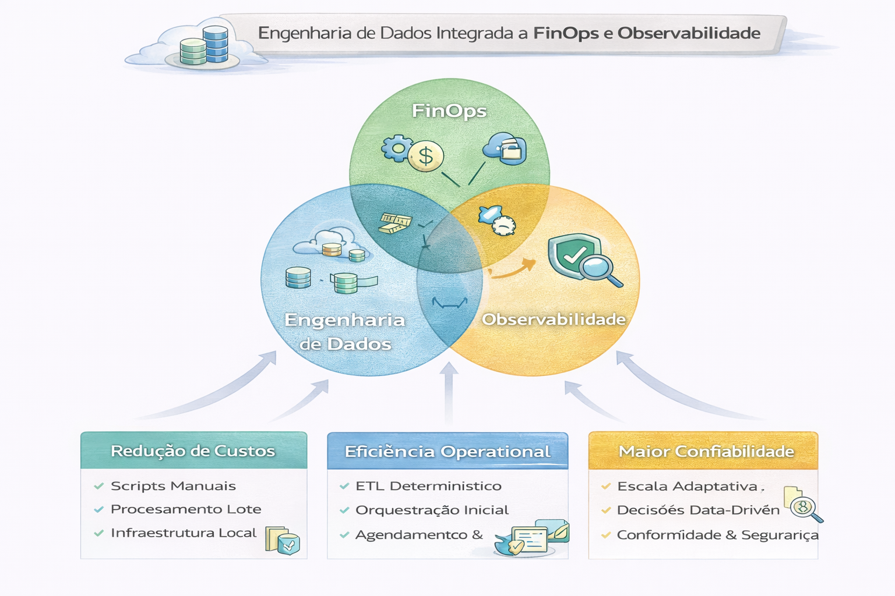

# Engenharia de Dados Integrada a FinOps + Observabilidade

A integração entre Engenharia de Dados, FinOps (gestão financeira em nuvem) e Observabilidade é uma abordagem essencial para plataformas modernas de dados, focada em transformar pipelines de dados complexos em produtos confiáveis, eficientes e de custo otimizado. Essa união permite que as empresas gerenciem grandes volumes de dados (Big Data) sem estourar o orçamento da nuvem. 

---

---

### O Papel da Engenharia de Dados nesta Tríade

A Engenharia de Dados é o alicerce onde FinOps e Observabilidade se encontram para garantir que o ciclo de vida do dado seja otimizado:

- Automação e DataOps: Utiliza práticas de DataOps para automatizar o fluxo de coleta e processamento, reduzindo desperdícios manuais e erros que geram custos extras.

- Eficiência de Arquitetura: Implementa arquiteturas modernas como Lakehouse (Databricks, Snowflake) que permitem maior controle granular sobre o consumo de recursos computacionais e armazenamento.

- Qualidade do Dado: A observabilidade de dados garante que os pipelines não processem dados errôneos, o que consumiria créditos de nuvem sem gerar valor. 

### FinOps: Gestão Financeira de Dados 

O foco aqui é a visibilidade e a responsabilidade sobre os custos de infraestrutura (cloud): 

- Showback e Chargeback: Identifica exatamente qual pipeline ou equipe está consumindo quais recursos no Azure Data Factory, AWS ou GCP.

- Previsibilidade: Uso de dados históricos para prever faturas futuras e evitar surpresas no final do mês.

- Otimização Contínua: Ajuste de instâncias, tipos de armazenamento e tempos de execução para maximizar o ROI de cada byte processado. 

### Observabilidade: O Olho no Pipeline

Enquanto o monitoramento diz se algo quebrou, a Observabilidade explica por que quebrou e qual o impacto: 

- Três Pilares: Métricas, logs e rastreamento (tracing) integrados em plataformas como Datadog ou New Relic.

- Data Observability: Monitora a saúde do dado (esquema, frescor, volume) para garantir que a IA e os relatórios recebam informações confiáveis.

- Integração com Custo: Ferramentas modernas conectam o desempenho técnico diretamente ao gasto, permitindo ver, por exemplo, o custo exato de uma consulta SQL lenta. 

### Ferramentas e Soluções

- Plataformas de Observabilidade: Datadog, New Relic, Dynatrace, Splunk, Dedalus Argos.

- Ferramentas FinOps/Cloud: CloudZero, Azure Data Factory (para controle de custos em nuvem), AWS.

- Plataformas de Dados: Snowflake, Databricks, AWS S3/Redshift.

### Benefícios da Integração

- 1. Redução de Desperdício: Elimina pipelines "zumbis" que rodam sem necessidade.

- 2. Agilidade de Negócio: Transforma gastos em nuvem em investimentos estratégicos, focados em valor.

- 3. Confiabilidade: Garante que o dado chegue no tempo certo (SLA) e com o custo previsto (SLO financeiro). 

## Engenharia orientada a custo

- Custo por pipeline
- Custo por domínio
- Custo por workload (ML, BI, Ad-hoc)

## Métricas essenciais

- Tempo médio de execução
- Custo por TB processado
- Falhas por SLA
- Latência por camada

## Integração estratégica

Engenharia moderna conecta:

Performance → Observabilidade → Custo → Governança

O engenheiro Staff pensa em sustentabilidade, não apenas funcionalidade.

# Conclusão

A convergência dessas áreas é essencial à medida que mais de 40% das cargas de trabalho corporativas migram para a nuvem, tornando o monitoramento de custos e eficiência operacional inseparável da engenharia de dados.

## 🔜 Próximo

➡️ [Decisão DE]](5-decisoes-comparativas-spark-flink-sql-engines.md)

