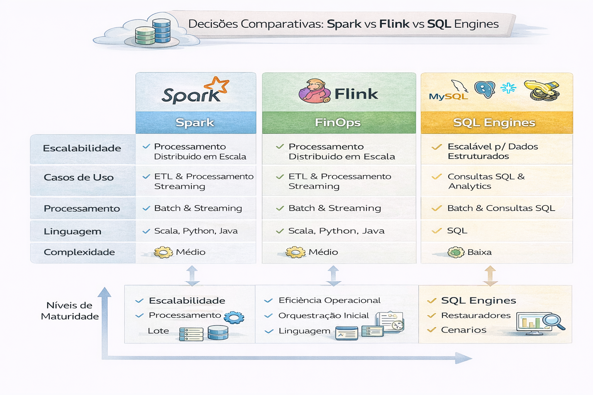

# Decisões Comparativas: Spark vs Flink vs SQL Engines (Staff/Principal)

Para escolher a tecnologia ideal de processamento de dados, a decisão geralmente gira em torno de três eixos: a natureza dos dados (lote ou tempo real), a latência aceitável e a familiaridade da equipe com a linguagem.

A escolha do motor define: custo, complexidade operacional, time-to-value e confiabilidade.

---

---

### 1) Quando Spark é a melhor escolha

O Apache Spark é a escolha padrão para a maioria das empresas devido ao seu ecossistema maduro e versatilidade

    - Modelo de Processamento: Baseado em micro-lotes (micro-batching). Ele coleta eventos por um curto período (ex: 1 segundo) e os processa juntos.

    - Melhor para: Processamento em lote (Batch), ETLs complexos, Machine Learning (MLlib) e análise exploratória de grandes volumes de dados.

    - Vantagem: Facilidade de encontrar profissionais e farta documentação. Suporta Java, Scala, Python e R.

    - Limitação: Latência na casa dos segundos, o que pode não ser ideal para sistemas de alta performance em tempo real.

**Use Spark quando:**
- O workload é **batch pesado** (joins grandes, agregações massivas, jobs longos)
- Você precisa de **ecossistema** (Delta/Iceberg connectors, MLlib, integração com Data Lake)
- O time já domina tuning (shuffle, partitions, AQE, skew)

**Evite Spark quando:**
- Você quer baixa latência real em eventos (streaming “de verdade”)
- O time não tem maturidade operacional (custo explode fácil)
- O caso é simples e SQL-first resolve com menos fricção

**Sinais de que Spark vai doer em produção**
- Muitos jobs com **small files + shuffle pesado**
- Backfills frequentes sem estratégia
- Falta de SLAs/SLOs e observabilidade

---

### 2) Quando Flink é a melhor escolha

O Apache Flink foi desenhado do zero para processar dados evento a evento, sem esperar pela formação de lotes. 

    - Modelo de Processamento: Streaming nativo (true streaming). Cada evento é processado instantaneamente assim que chega.
    
    - Melhor para: Aplicações que exigem latência de milissegundos, detecção de fraude em tempo real, sistemas de recomendação instantânea e monitoramento de sensores (IoT).
    
    - Vantagem: Gerenciamento superior de "estado" (stateful computing) e processamento preciso de dados que chegam atrasados (watermarks).
    
    - Limitação: Curva de aprendizado mais íngreme e ecossistema ligeiramente menor que o do Spark.

**Use Flink quando:**
- Você precisa de **streaming contínuo** (baixa latência, event-time, watermarks)
- Precisão em **stateful processing** (janelas, agregações com estado, CEP)
- Você precisa de **exactly-once** com checkpoints consistentes

**Evite Flink quando:**
- Seu “streaming” é apenas micro-batch
- O time não tem maturidade para **state, checkpoints, savepoints**
- Você não tem governança forte para evolução de schema/eventos

**Riscos comuns**
- Estado crescendo sem controle (state blow-up)
- Checkpoints lentos e instáveis
- Complexidade de operação maior que o valor entregue

---

### 3) Quando SQL Engines (Trino/Presto/Athena/BigQuery/Snowflake) são a melhor escolha

Motores SQL são camadas de abstração que permitem consultar dados usando a linguagem SQL, sem a necessidade de escrever código em Java ou Python

    - Spark SQL / Flink SQL: Permitem usar a lógica dessas engines via SQL. O Flink SQL, por exemplo, permite criar consultas contínuas sobre streams de dados.

    - Trino / Presto: Focados em consultas ad-hoc rápidas diretamente sobre Data Lakes (S3, HDFS) ou múltiplos bancos de dados, sem a necessidade de mover os dados.

    - Melhor para: Analistas de dados e Business Intelligence (BI) que precisam de respostas rápidas a partir de SQL padrão.

**Use SQL Engines quando:**
- O objetivo é **analytics, serving e exploração** (ad-hoc, dashboards, semântica)
- Você quer **time rápido** e governança clara via catálogo/permissions
- O workload é “SQL-first” (modelagem, métricas, camada semântica)

**Evite SQL Engines quando:**
- Você precisa de transformações complexas (stateful, streaming real, pipelines de ML)
- Você depende de UDFs pesadas e processamento procedural contínuo
- Você precisa de controle fino de execução que o engine não entrega

---

### 4) Heurística Staff (regra prática)

- **Flink**: eventos contínuos + estado + latência baixa + event time
- **Spark**: batch pesado + transformações complexas + escala e ecossistema
- **SQL Engines**: serving, semântica, BI, exploração, custo previsível (se bem governado)

---

## Matriz (visão executiva + técnica)

A matriz abaixo ajuda a documentar decisões de plataforma (e reduzir “arquitetura por opinião”).

> Dica Staff: registre a decisão como ADR (Architecture Decision Record) quando for relevante.

    Como usar (prático):
    1- Escolha 3 decisões que mais impactam custo + confiabilidade.  
    2- Preencha “Riscos & Dívidas” com ações mitigadoras (compaction, SLO, tagging, etc.).  
    3- Transforme as decisões em ADRs com data e dono.  

| Decisão | Opção A | Opção B | Quando A ganha | Quando B ganha | Riscos & Dívidas |
|---|---|---|---|---|---|
| Streaming | Flink | Micro-batch (Spark/DBT incremental) | Latência baixa, event-time, estado | Simplicidade, time menor, SLAs em minutos | Flink: operação complexa / Micro-batch: “quase real-time” |
| Tabelas Lakehouse | Iceberg | Delta | Open format, multi-engine, catalog-first | Ecossistema Databricks, ergonomia | Iceberg: metadata/compaction / Delta: lock-in |
| Serving | Trino/Presto | Warehouse (BQ/Snowflake) | Federado, open, custo por consulta | Elasticidade, recursos nativos | Trino: tuning / Warehouse: custo e lock-in |
| Modelagem | Camada Semântica | Métricas em cada BI | Governança de métricas, consistência | Agilidade local e autonomia | Semântica: adoção / BI local: divergência |
| Qualidade | Contratos + Monitoramento | Apenas testes | Prevenção + detecção | Fácil de começar | Contratos exigem cultura / Só testes não evitam quebra |
| Orquestração | Airflow/Dagster | Event-driven (orquestração por evento) | Visibilidade e governança central | Escala e desacoplamento | Airflow: backfills complexos / Event-driven: debugging |
| Entrega | CI/CD forte | Deploy manual | Reprodutibilidade, rollback, segurança | Curto prazo | Manual vira risco, regressões e auditoria fraca |
| FinOps | Custo por domínio | Custo agregado | Accountability, otimização contínua | Simples de medir | Domínio exige tagging/ownership / Agregado mascara desperdício |

---
### Conclusão: Checklist de decisão (perguntas que mudam o jogo)

1- Qual é a **latência necessária** (segundos? minutos? horas?)  
2- O problema é **stateful**? (janelas, agregação por sessão, deduplicação por evento)  
3- O dado chega por **event time** e fora de ordem?  
4- Você precisa de **replay/backfill** frequente? Como será controlado?  
5- Qual é o **custo por TB** e o budget de erro (error budget)?  
6- Quem opera isso 24/7? Existe on-call real?  
7- Qual a estratégia de **schema evolution** (contratos)? 

---

## 🔜 Próximo

➡️ [DE Entrevista](6-modelo-avaliacao-entrevista-staff.md)
