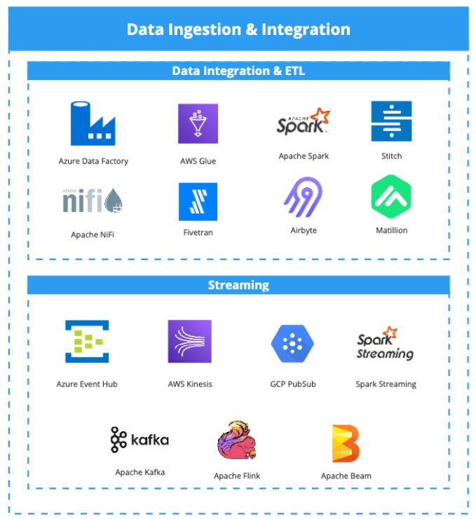

# 🔌 Ingestão

Ingestão é onde muitas plataformas começam… e onde muitas morrem.

Aqui você aprende:
- Quando usar Batch vs Streaming
- CDC como estratégia estrutural
- Evolução de schema sem quebrar downstream
- Impacto operacional real das decisões                                                                                                                                      

Principais ferramentas de ingestão Batch e Streaming
---

## 📂 Conteúdo

1. [Batch vs Streaming](1-batch-vs-streaming.md)  
2. [Padrões de CDC](2-padroes-cdc.md)  
3. [Evolução de Schema](3-evolucao-de-schema.md)

---

## 🔎 Pergunta central

Sua ingestão foi desenhada para crescer…  
ou apenas para funcionar agora?

---

## 🔜 Próximo Capítulo

[3-Storage & Lakahouse](../3-storage-lakehouse)
