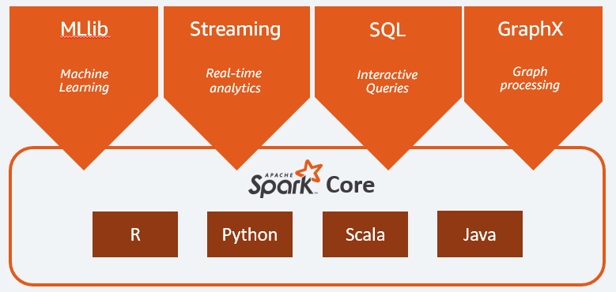

# Spark — Quando Usar e Quando NÃO Usar

Spark é uma ferramenta poderosa.
Mas poder não significa obrigação.

---

## Quando Spark é a escolha correta

- Volume massivo (TBs ou mais)
- Processamento distribuído inevitável
- Transformações complexas em larga escala
- Pipeline com múltiplos estágios paralelizáveis

---

## Quando Spark é overkill

- Dados < dezenas de GB
- Transformações simples
- Consultas analíticas exploratórias
- Time sem maturidade operacional

---

## Custos invisíveis do Spark

- Cluster tuning
- Debug distribuído
- Shuffle cost
- Memory management
- Infraestrutura constante mesmo sem uso

Muitas plataformas falham não por falta de capacidade,
mas por excesso de complexidade desnecessária.

💡O poder do Spark:

#### [💡Quer saber mais sobre Spark?](https://aws.amazon.com/what-is/apache-spark/)
---

## Cenários comuns onde usar Spark

Spark faz sentido quando está integrado
a pipelines estruturados e monitorados.

---

## Perguntas de arquitetura

- O volume justifica distribuição?
- Existe alternativa SQL-first?
- O time sustenta operação 24/7?
- O ganho compensa o custo cognitivo?

---

## 🔜 Próximo

➡️ [DuckDB e Polars](2-duckdb-polars.md)
