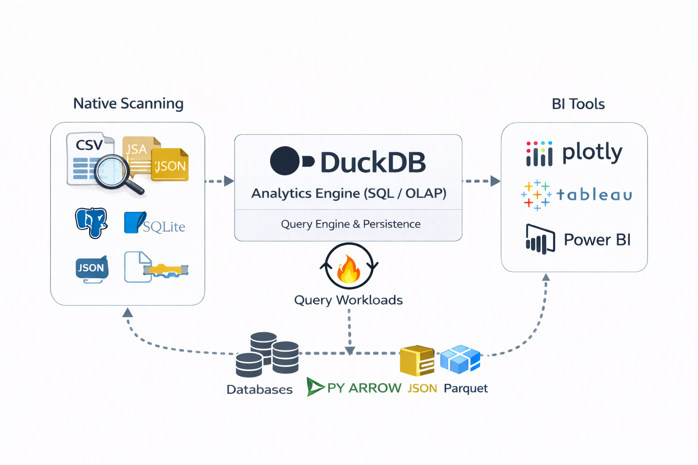
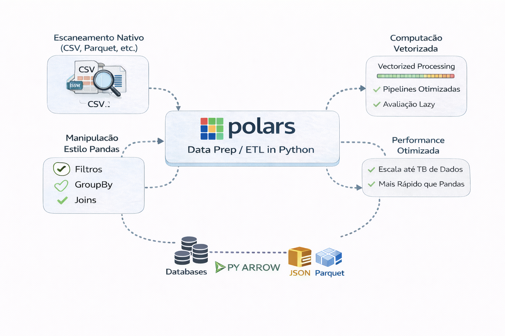
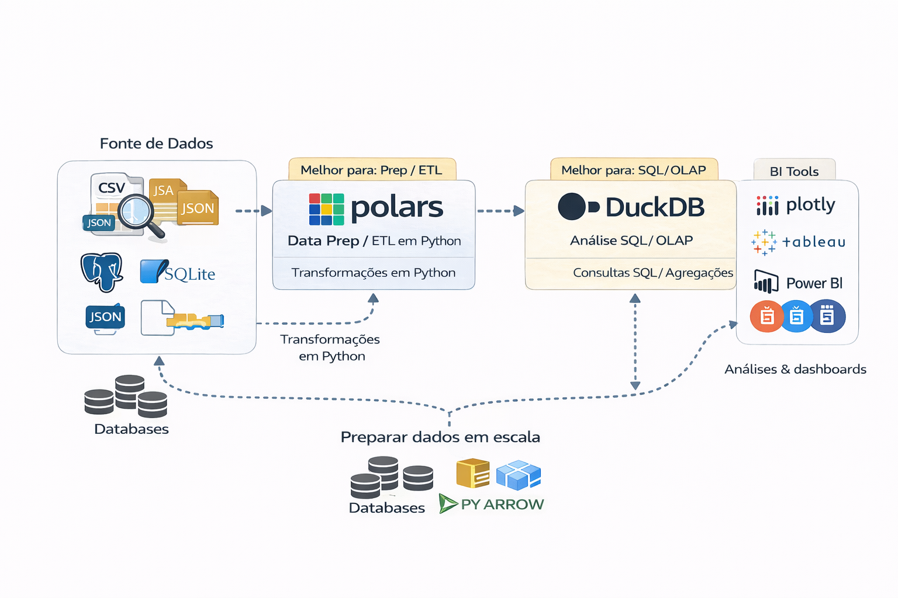

# DuckDB, Polars e o Poder do Single Node

Nem todo processamento precisa ser distribuído, como Spark

Ferramentas modernas single-node conseguem:

- Processar dezenas de GB eficientemente
- Rodar análises locais rápidas
- Reduzir custo de infraestrutura
- Simplificar desenvolvimento

---

### Quando usar DuckDB

- Analytics exploratório
- Transformações intermediárias
- Jobs leves
- Processamento local ou serverless

#### [💡Saiba mais e como começar a usar DuckDB](https://duckdb.org/)
---

### Quando usar Polars

- Transformações vetorizadas rápidas
- Pipelines Python otimizados
- Workloads menores e médios

#### [💡Saiba mais e como começar a usar Polars](https://pola.rs/)

---

### DuckDB vs Polars

-> Nem sempre a decisão é simples

💡Analise certinho o cenário e o que precisa realmente ser revolvido.

---

### Polars e DuckDB juntos | Combinam muito bem onde cada um tem de melhor

💡 uma imagem vale mais que 1000 palavras. Essa imagem pode simplificar melhor onde cada um é melhor.

---

## Trade-off

Single node:
- Simplicidade
- Baixo custo
- Menor complexidade operacional

Distribuído:
- Escala massiva
- Maior resiliência
- Maior complexidade

---

## Anti-pattern

“Já temos Spark, então vamos usar Spark para tudo.”

Ferramenta não deve ditar arquitetura.

---

## 🔜 Próximo

➡️ [Plataformas SQL-First](3-sql-first-platforms.md)
