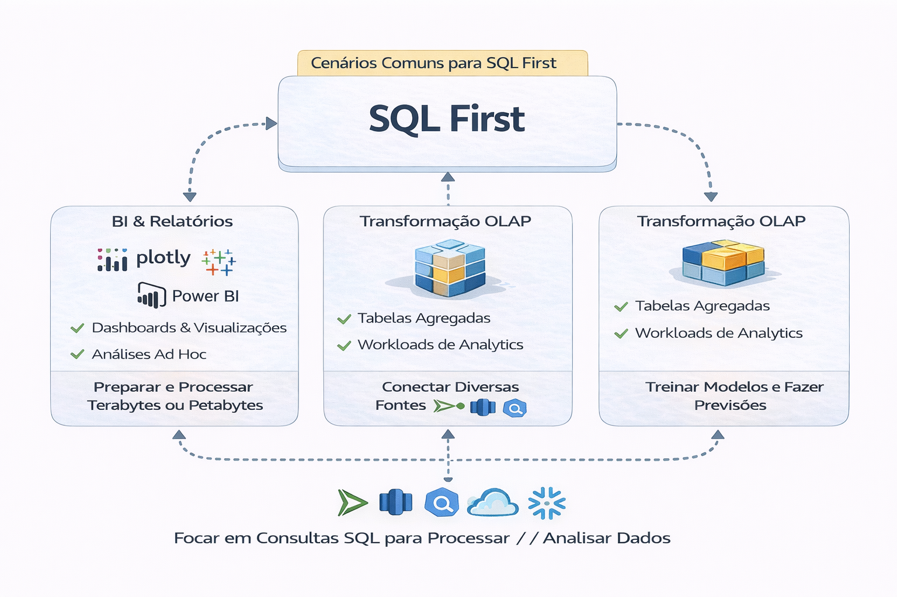

# Plataformas SQL-First

SQL continua sendo a linguagem dominante da análise.

💡Dica: [Aprenda SQL com laboratório e problemas reais.](https://github.com/fabiomarcolia/sql-data-analysis-pratico)

Plataformas SQL-first priorizam:

- Simplicidade
- Governança centralizada
- Performance previsível
- Adoção ampla

---

## Engines comuns

- BigQuery
- Athena
- Trino
- Snowflake

---

## Vantagens

- Menor complexidade operacional
- Curva de aprendizado menor
- Foco no dado, não na infraestrutura

---

## Limitações

- Menor controle de processamento distribuído fino
- Dependência maior do engine
- Custo pode crescer com queries mal desenhadas

---

## Decisão estratégica

Pergunta real:

Seu problema é de escala técnica  
ou de organização de dados?

Muitas vezes a resposta é a segunda.

---

## Conexão com arquitetura

Processamento deve ser consequência da arquitetura,
não decisão isolada.

---

## 🔜 Próximo Capítulo

- [5-Orquestração](../5-orquestracao)
