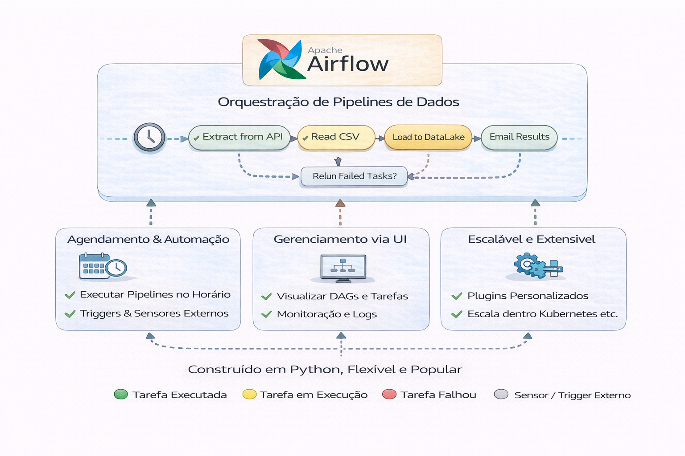

# Airflow em Produção

Airflow não é apenas um scheduler.
É o sistema nervoso da sua plataforma.

Apache Airflow é uma plataforma open-source de orquestração de fluxos de trabalho (workflows).

Ele utiliza Python para agendar, gerenciar e monitorar pipelines de dados complexos (ETL/ELT) e tarefas de automação, permitindo visualizar o progresso por meio de grafos acíclicos direcionados (DAGs). 

---

## O que diferencia produção de laboratório

Em produção você precisa de:

- Observabilidade real (logs estruturados, métricas, alertas)
- Controle de dependências entre domínios
- Estratégia clara de retry
- Idempotência garantida
- Backfill controlado

---

- Orquestração atravessa ingestão, processamento, qualidade e analytics.

---

## Problemas comuns em ambientes reais

- DAGs gigantes com 40+ tasks acopladas
- Dependências implícitas (não declaradas)
- Backfills manuais perigosos
- Retry infinito mascarando erro estrutural
- Falta de separação entre ambiente de teste e produção

---

## Idempotência (obrigatório)

Um job idempotente pode rodar múltiplas vezes
sem alterar resultado final.

Sem idempotência:
- Retry vira risco
- Backfill vira pesadelo
- Incidente vira desastre

---

## Retry vs Ação Compensatória

Retry é válido quando:
- Falha transitória (rede, timeout)

Não é válido quando:
- Erro lógico
- Schema incompatível
- Dados inconsistentes

Nestes casos, é preciso:
- Parar execução
- Abrir incidente
- Corrigir causa raiz

---

## Perguntas que líderes deveriam fazer

- Qual é nosso SLO de pipeline crítico?
- Temos alertas por impacto ou por erro técnico?
- Conseguimos reprocessar 30 dias atrás com segurança?
- Existe dono por DAG?

---

## 🔜 Próximo

- [Princípios de Design de DAG](2-principios-design-dag.md)
