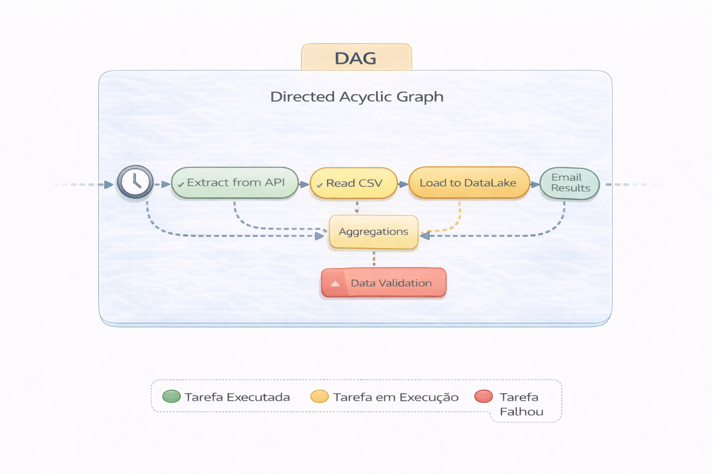

# Princípios de Design de DAG

DAG mal desenhado vira dívida estrutural.

Uma DAG define a ordem lógica e a dependência entre tarefas em um sistema, no caso sob a orquestração, garantindo eficiência e evitando repetições desnecessárias. 

---

## Princípios Fundamentais

### 1. Baixo acoplamento

Evite:
- DAG único para múltiplos domínios
- Dependências cruzadas invisíveis

Prefira:
- DAG por domínio
- Contratos claros entre camadas

---

### 2. Tarefas pequenas e previsíveis

- Uma responsabilidade por task
- Sem lógica de negócio escondida em operadores
- Versionamento explícito

---

### 3. Backfill como requisito

Se o DAG não suporta backfill seguro,
ele não está pronto para produção.

Backfill exige:
- Particionamento consistente
- Idempotência
- Controle de janela temporal

---

### 4. Observabilidade estruturada

Monitorar apenas “falhou ou não” é infantil.

Você deve monitorar:
- Duração
- Volume processado
- Freshness
- Drift inesperado

---

## Anti-pattern clássico

“Criamos um DAG enorme para simplificar.”

Isso simplifica no curto prazo.
Complica exponencialmente no médio.

---

## 🔜 Próximo

➡️ [Orquestração Orientada a Eventos](./orquestracao-eventos.md)
