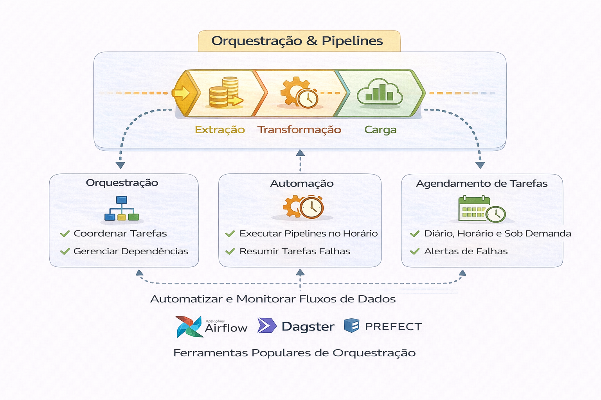

# 🕸️ Orquestração

Orquestração é onde plataformas maduras se diferenciam de pipelines improvisados.

Pipeline que roda não é plataforma.

Pipeline observável, reprocessável e previsível é.

Este capítulo aprofunda:

- Airflow em produção (de verdade)
- Princípios de design de DAG
- Idempotência e backfills seguros
- Retry vs ação compensatória
- Orquestração orientada a eventos
- SLAs, SLOs e impacto no negócio

---

## 📂 Conteúdo

1. [Airflow em Produção](1-airflow-em-producao.md)  
2. [Princípios de Design de DAG](2-principios-design-dag.md)  
3. [Orquestração Orientada a Eventos](3-orquestracao-eventos.md)

---

## 🔎 Pergunta central

Se um pipeline falhar hoje às 03:17 da manhã…

Você sabe:
- Quem é impactado?
- Como reprocessar?
- Quanto isso custa?
- Quem é dono da decisão?

---

## 🔜 Próximo Capítulo

- [6-Qualidade de Dados](../6-qualidade-de-dados)
