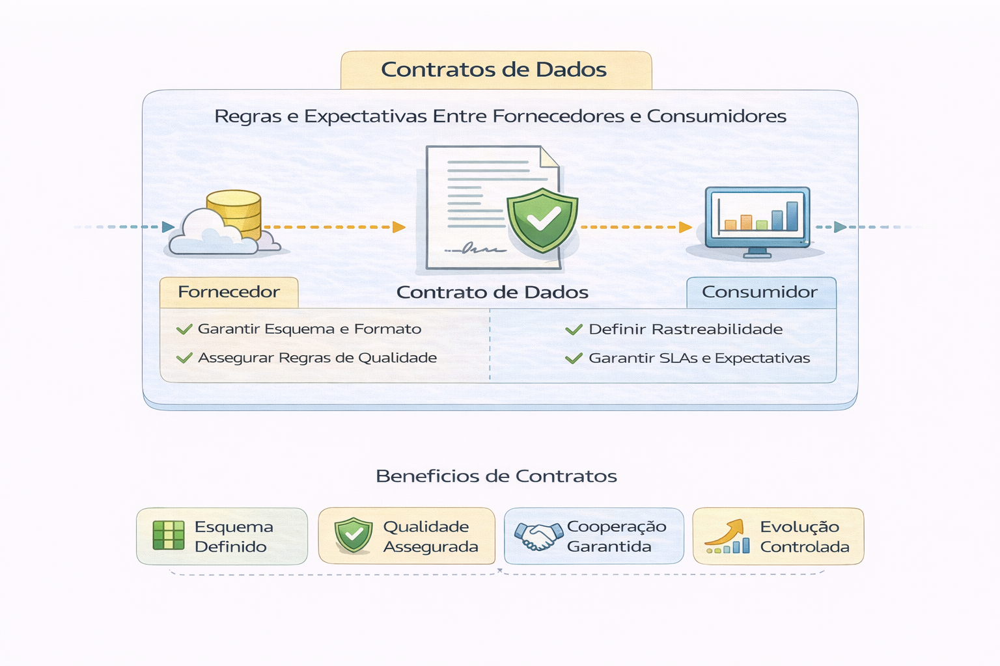

# Contratos de Dados

Contrato de dados define:

- Estrutura esperada
- Regras de validação
- Responsabilidade por mudança
- Processo de aprovação

Sem contrato, existe dependência frágil.

---

Principais Elementos de um Contrato de Dados:

- Estrutura e Schema: Campos, tipos de dados e formatos (ex: JSON, Parquet).

- Qualidade e Regras: Definições de valores não nulos, intervalos válidos e integridade.

- Semântica: Significado de cada campo (ex: o que define "Receita").

- SLAs (Acordo de Nível de Serviço): Frequência de atualização e disponibilidade.

- Responsáveis: Proprietários do dado e do produto de dados. 

Benefícios da Implementação:

- Prevenção de Incêndios: Diferente da governança reativa, os contratos garantem a qualidade na origem, evitando que dados ruins cheguem ao consumidor.

- Confiabilidade: Reduz a quebra de pipelines devido a alterações inesperadas no esquema.

- Melhor Descoberta: Facilita o mapeamento e entendimento dos dados. 

Os contratos de dados surgiram para resolver a desconfiança em dados, evoluindo a governança de um modelo reativo para proativo, sendo criados pelo produtor para múltiplos consumidores. 

---

## Fundamental no contrato de dados

- Esquema versionado
- Regras de validação obrigatórias
- SLA de atualização
- Dono do dataset
- Política de evolução

---

## Evolução controlada

Mudança de schema deve:

1. Ser comunicada
2. Ser versionada
3. Garantir compatibilidade (quando necessário)
4. Ter janela de transição

---

## Impacto organizacional

Contratos reduzem:

- Conflitos entre times
- Quebra silenciosa de dashboards
- Incidentes recorrentes

---

## Anti-pattern

“Alteramos a tabela e avisamos depois.”

Isso não é evolução.
É ruptura.

## 🔜 Próximo

➡️ [Expectativas e Monitoramento](3-expectativas-e-monitoramento.md)
