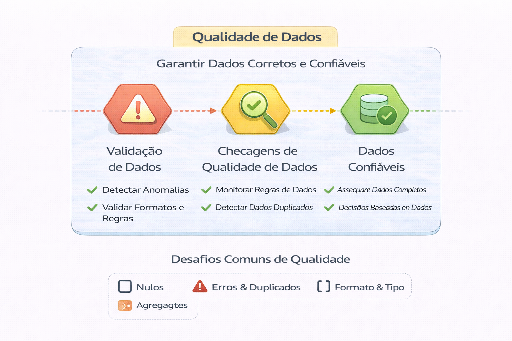

# 🧪 Qualidade de Dados

Qualidade de dados não é “ter testes”.
É garantir confiança organizacional em escala.

Este capítulo aborda:

- Qualidade como camada arquitetural
- Contratos de dados (Data Contracts)
- Expectations estruturadas
- Monitoramento de freshness, volume e anomalias
- Impacto executivo da qualidade

---

## 📂 Conteúdo

1. [Qualidade não é apenas teste](1-qualidade-nao-e-apenas-teste.md)  
2. [Contratos de Dados](2-contratos-de-dados.md)  
3. [Expectations e Monitoramento](3-expectativas-e-monitoramento.md)

---

- Qualidade atravessa ingestão, armazenamento, processamento e analytics.

---

## 🔜 Próximo Capítulo

- [7-governanca-e-seguranca](7-governanca-e-seguranca)
