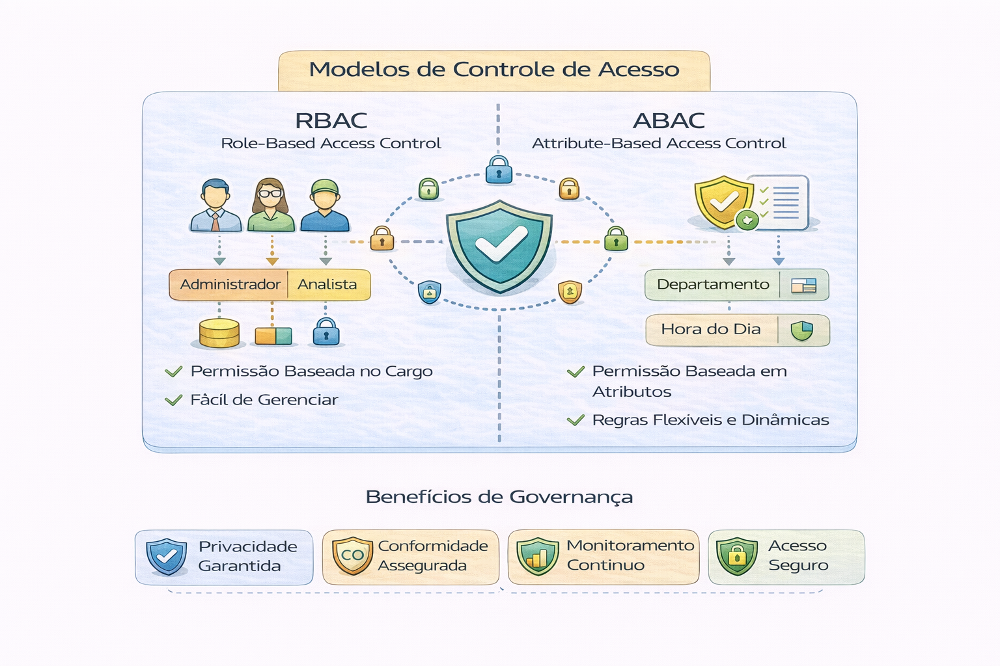

# 🔒 Modelos de Controle de Acesso

Controle de acesso não é dar permissão.
É definir política.

O controle de acesso de dados é um conjunto de regras e processos que define quem pode visualizar, editar ou utilizar informações específicas dentro de um sistema. 

Ele serve como uma linha de defesa crítica para garantir que apenas usuários autorizados acessem os ativos digitais da organização, protegendo contra vazamentos e acessos indevidos.

Principais Modelos de Controle de Acesso

- RBAC (Baseado em Funções): As permissões são vinculadas a cargos ou funções (ex: "Gerente Financeiro") em vez de indivíduos específicos. É o modelo mais comum em empresas para simplificar a gestão.

- ABAC (Baseado em Atributos): Utiliza políticas dinâmicas que consideram atributos do usuário (cargo), do recurso (sensibilidade) e do ambiente (horário ou localização).

Benefícios da Implementação

- Segurança e Conformidade: Garante a proteção de propriedade intelectual e ajuda na adequação à Lei Geral de Proteção de Dados (LGPD).

- Princípio do Privilégio Mínimo (PoLP): Garante que usuários tenham apenas o acesso estritamente necessário para realizar suas tarefas, reduzindo a superfície de ataque.

- Rastreabilidade: Permite monitorar e registrar quem acessou quais dados e quando, facilitando auditorias. 

Melhores Práticas

Para uma gestão eficiente, recomenda-se o uso de senhas fortes, a implementação de autenticação de dois fatores e o uso de ferramentas como o Microsoft Entra ID (antigo Azure AD) para centralização de identidades. Além disso, revisões periódicas de acesso são essenciais para remover permissões de ex-colaboradores ou contas inativas.

---

## RBAC vs ABAC

### RBAC (Role-Based Access Control)

- Acesso baseado em função
- Simples de implementar
- Escala até certo ponto

Problema:
Explode em quantidade de roles conforme complexidade aumenta.

---

### ABAC (Attribute-Based Access Control)

- Baseado em atributos (domínio, sensibilidade, país, etc.)
- Mais flexível
- Escala melhor em ambientes complexos

Exemplo:
Usuário pode acessar dados apenas se:
- Pertencer ao domínio X
- Estiver na região Y
- Dataset for classificado como interno

---

## Erro estrutural comum

“Criamos uma role para cada exceção.”

Isso gera:
- Complexidade
- Risco
- Auditoria impossível

---

## Perguntas estratégicas

- Quem aprova concessão de acesso?
- Existe segregação por domínio?
- Temos política clara de revogação?
- Acesso é revisado periodicamente?

---

## Governança madura implica

- Políticas declarativas
- Automação de permissões
- Versionamento de políticas
- Auditoria automática

---

## 🔜 Próximo

➡️ [Segurança em Nível de Linha e Coluna](2-seguranca-nivel-linha-coluna.md)
