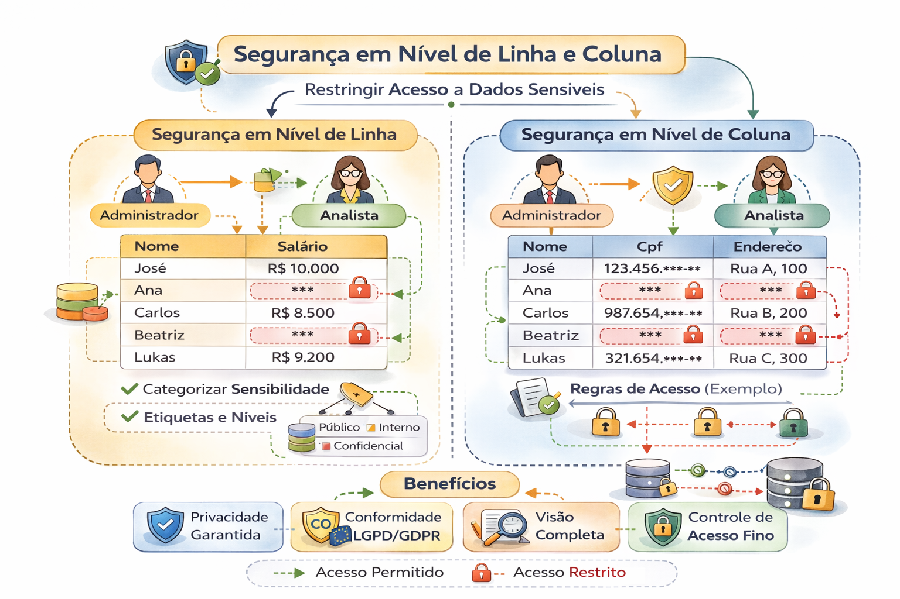

# Segurança em Nível de Linha e Coluna

Nem todo acesso é binário.

Em ambientes corporativos, é comum precisar:

- Mascarar colunas sensíveis
- Filtrar linhas por região
- Restringir dados por unidade de negócio

---
A segurança em nível de linha (RLS) e coluna (CLS) controla o acesso aos dados com precisão, permitindo que usuários visualizem apenas informações autorizadas, restringindo linhas específicas por usuário (RLS) ou colunas sensíveis (CLS). A lógica é implementada no banco de dados, garantindo consistência no Power BI, SQL Server e outras plataformas, simplificando a governança e aumentando a robustez.

## Row-Level Security (RLS)

- Restringe as linhas de dados que um usuário pode visualizar, filtrando-as com base em funções (roles) e permissões.

- Aplicação: Ideal para cenários onde, por exemplo, um gerente de vendas regional só deve ver os dados da sua própria região.

- Exemplo:
Usuário da região Sul só visualiza dados da região Sul.

---

## Column-Level Security (CLS)

- Controla quem pode visualizar colunas específicas em uma tabela, escondendo dados sensíveis (ex: salários, CPF) de usuários não autorizados.

- Aplicação: Usada para restringir o acesso a colunas sensíveis, mesmo que o usuário tenha permissão para ver a linha inteira.

- Funcionamento: Diferente do RLS que filtra registros, o CLS impede o acesso a colunas, tornando-as invisíveis nas visualizações de consulta.

Exemplo:
Campo de CPF visível apenas para área autorizada.

---

## Risco comum

Implementar segurança apenas no BI.

Se a segurança não estiver na camada de dados,
ela pode ser burlada.

---

## Arquitetura correta

A implementação correta de RLS e CLS é fundamental para manter a confidencialidade e a integridade dos dados em ambientes corporativos, especialmente com ferramentas de autoatendimento

Segurança deve existir:

- No storage
- No catálogo
- No engine de consulta
- Na camada semântica

---

## Perguntas de maturidade

- Segurança é aplicada no dado ou na ferramenta?
- Temos política uniforme multi-engine?
- Conseguimos provar quem acessou o quê?

---

## 🔜 Próximo

➡️ [Classificação, Auditoria e Rastreabilidade](3-classificacao-auditoria-rastreabilidade.md)
