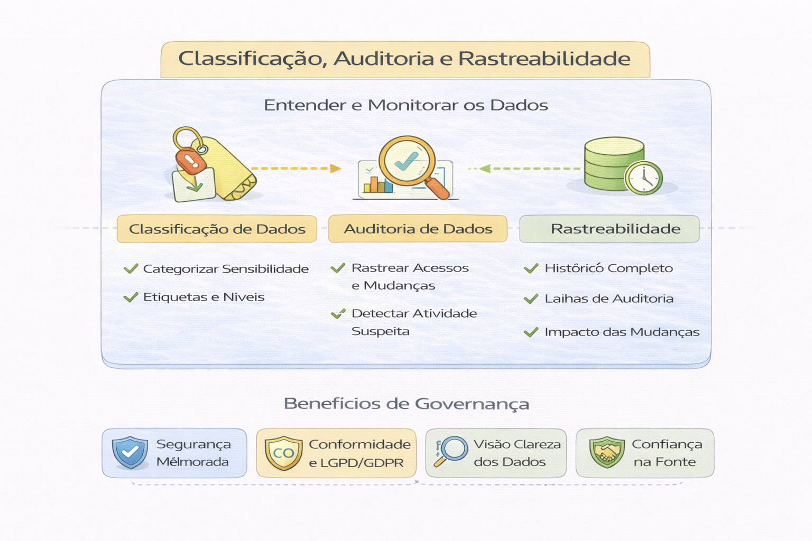

# Classificação, Auditoria e Rastreabilidade

Governança sem rastreabilidade é ilusão.

A Classificação, Auditoria e Rastreabilidade de dados são pilares fundamentais da Governança de Dados e essenciais para a conformidade com a LGPD (Lei Geral de Proteção de Dados), garantindo a segurança, a integridade e a privacidade da informação ao longo de todo o seu ciclo de vida. 

### 1. Classificação de Dados
A classificação consiste em identificar e categorizar dados com base em seu nível de sensibilidade, valor e importância para a organização. Isso facilita a aplicação de controles de segurança adequados (quem pode acessar o quê). 

- Categorias Típicas: Público, Interno, Confidencial, Restrito.

- Dados Pessoais e Sensíveis (LGPD): Identificação de dados que permitem identificar uma pessoa física (Nome, CPF) e dados especiais (origem racial, convicções religiosas, dados de saúde, biométricos) que exigem proteção especial.

- Metadados: Dados sobre os dados, usados para descrever e contextualizar as informações (tipo, origem, responsável). 

### 2. Auditoria de Dados
A auditoria é uma avaliação sistemática da coleta, armazenamento e uso de dados para garantir que as políticas internas e regulamentações (como a LGPD) estejam sendo seguidas. 

- Tipos de Auditoria: Interna (realizada pela própria organização), Externa (terceiros) e Governamental.

- Objetivos: Verificar a integridade dos dados (completos, corretos), avaliar a eficácia dos controles internos e evitar vazamentos.

- Auditoria de Sistemas/TI: Monitoramento em tempo real (NRT) ou registros históricos (logs) para identificar quem acessou ou modificou dados. 

### 3. Rastreabilidade de Dados
A rastreabilidade (ou linhagem de dados) acompanha o fluxo, as transformações e o uso dos dados desde sua origem até o destino final. 

- Ciclo de Vida: Permite acompanhar o dado desde a criação, processamento, armazenamento, até a eliminação.

- Identificação Única: Uso de metadados, códigos ou lotes para monitorar a jornada da informação, garantindo que o dado não foi corrompido e está em conformidade.

- Importância: Essencial para transparência, auditorias de conformidade e resolução de problemas (root cause analysis). 

### Relação entre os Pilares

- A Classificação define o que deve ser protegido.

- A Rastreabilidade mostra por onde o dado passou e quem o manuseou.

- A Auditoria confirma se as regras de proteção foram aplicadas corretamente durante todo o processo.

Benefícios: Adoção de boas práticas de gestão, redução de riscos de vazamento de dados, conformidade regulatória (compliance) e maior confiabilidade nas decisões de negócios baseadas em dados.

---

## Classificação de Dados

Datasets devem ser classificados como:

- Público
- Interno
- Sensível
- Regulamentado

Classificação define política de acesso e retenção.

---

## Auditoria

Auditoria deve responder:

- Quem acessou?
- Quando?
- O que consultou?
- Qual volume foi extraído?

Logs sem estrutura não são auditoria.
São apenas histórico técnico.

---

## Lineage (Rastreabilidade)

Você deve conseguir responder:

- De onde veio esta métrica?
- Qual pipeline transformou este dado?
- Qual versão da transformação foi usada?

---

## Anti-pattern crítico

“A segurança está no contrato do funcionário.”

Governança não pode depender apenas de confiança humana.
Precisa de controle sistêmico.

---

## Conexão com Jurídico e Compliance

Plataforma madura conversa com:

- LGPD
- Auditoria interna
- Risco corporativo
- Cibersegurança

Governança não é custo.
É mitigação de risco estratégico.

---

## Indicadores de maturidade

- % de datasets classificados
- % de acessos auditáveis
- Tempo médio para revogar acesso
- Incidentes de acesso indevido

---

## 🔜 Próximo Capítulo

➡️ [Serving Analytics](8-serving-analytics)
