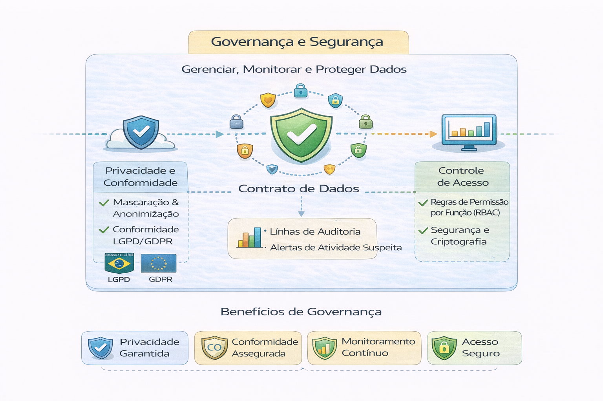

# 🔐 Governança e Segurança

Se qualidade gera confiança técnica,
governança gera confiança organizacional.

Plataformas maduras não tratam governança como burocracia.
Tratam como arquitetura.

Este capítulo aprofunda:

- Modelos de controle de acesso (RBAC vs ABAC)
- Segurança em nível de linha e coluna
- Classificação de dados
- Auditoria e rastreabilidade
- Governança como responsabilidade estrutural
- Conexão entre tecnologia, risco e jurídico

---

## 📂 Conteúdo

1. [Modelos de Controle de Acesso](./modelos-de-controle-de-acesso.md)  
2. [Segurança em Nível de Linha e Coluna](./seguranca-nivel-linha-coluna.md)  
3. [Classificação, Auditoria e Rastreabilidade](./classificacao-auditoria-rastreabilidade.md)

---

Governança não é camada final.
É camada transversal.

---

## 🔜 Próximo Capítulo

➡️ [Analytics](../8-servindo-analytics)
