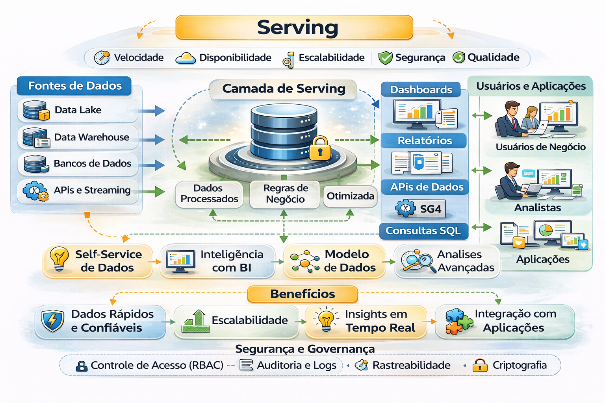

# Fundamentos de Serving

Serving é a camada responsável por transformar dados estruturados em **consumo confiável**.

Refere-se ao processo de disponibilizar dados processados e estruturados para usuários finais, aplicações ou ferramentas de análise com baixa latência. Ele atua na "última milha" da engenharia de dados, conectando data lakes/warehouses a aplicações (BI, IA/ML), permitindo consultas rápidas e consumo eficiente por meio de APIs

Ele garante:
- Performance previsível
- Custo controlado
- Governança aplicada no consumo
- Métricas oficiais consistentes

Sem Serving estruturado:
- Métricas divergem
- Custo explode
- Confiança executiva desaparece
- O BI vira “disputa de números”

---

### Como funciona na prática?

- 1- Processamento: Os dados brutos são limpos e transformados (via ETL/ELT).

- 2- Camada de Serving: Os dados "refinados" são movidos para sistemas otimizados para consulta.

- 3- Consumo: Ferramentas de BI, dashboards ou APIs acessam esses dados em milissegundos. 

### Principais Tecnologias

- Data Warehouses: Como o Google BigQuery ou Snowflake, ideais para analíticos e BI.

- Bancos NoSQL: Como o MongoDB ou Redis, usados para servir dados em tempo real para aplicativos.

- Feature Stores: Como o Feast, específicas para servir variáveis (features) para modelos de Machine Learning. 

### Por que é importante?

- Sem uma camada de serving eficiente, os dados ficam "presos" em silos técnicos. Ela garante que a decisão de um executivo ou a recomendação de um algoritmo aconteça no tempo certo, sem gargalos de performance.
Você está buscando uma solução de serving para análise de BI ou para alimentar modelos de Machine Learning?

--- 

## Serving ≠ Dashboard

Dashboard é interface.

Serving é o **modelo operacional completo**:
- Modelo curado (camadas e contratos)
- Semântica centralizada (métricas oficiais)
- Engine adequada (consulta, cache, concorrência)
- Política de acesso aplicada (governança)
- Estratégia de custo (FinOps)

---

## Perguntas de liderança (rápidas e decisivas)

- Existe **métrica oficial** para “Receita”, “Margem” e “Churn”?
- Quanto custa “abrir o painel executivo” por mês?
- Quem aprova mudanças na regra de negócio?
- Quem é dono do dataset e do consumo?

---

## Níveis de maturidade (visão geral)

Nível 1 — BI direto em tabela bruta (alto risco)  
Nível 2 — Tabelas curadas centralizadas (melhora)  
Nível 3 — Camada semântica versionada (confiança)  
Nível 4 — Serving operacionalizado (SLO + FinOps + governança)  
Nível 5 — Serving como produto (Data as a Product + ROI)

---

## 🔜 Próximo

➡️ [Camada Semântica](2-camada-semantica.md)
