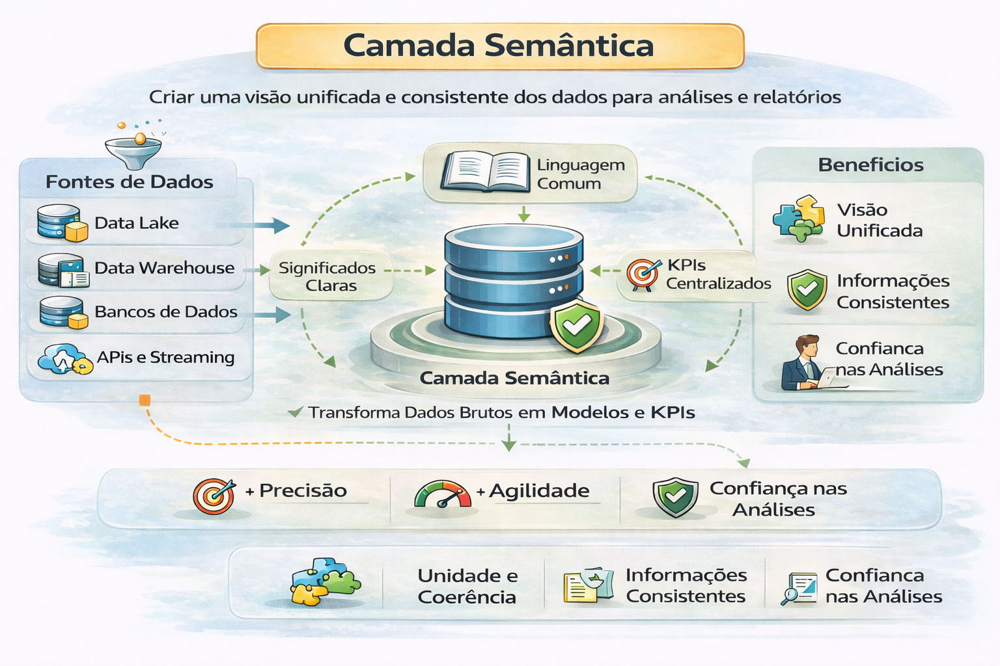

# Camada Semântica como Infraestrutura

Camada semântica é a definição central das regras de negócio que sustentam decisões.

Ela traduz tabelas e colunas complexas em termos de negócios intuitivos (ex: "Receita" em vez de F_SLS_001.REV), garantindo definições de métricas consistentes,governança centralizada e facilitando o self-service BI, sem a necessidade de conhecimento técnico em SQL. 

--- 

Principais Características e Benefícios:

- Abstração e Linguagem de Negócios: Transforma estruturas de dados técnicas em vocabulários familiares para usuários.

- Consistência de Métricas: Garante que "lucro" seja calculado da mesma forma em toda a organização, independente da ferramenta de BI usada.

- Centralização: Facilita a gestão de governança e segurança de dados, pois a lógica de negócios é centralizada, não replicada em cada relatório.

- Aceleração de IA e Analytics: Prepara dados de maneira organizada para aplicações de IA Generativa e análises avançadas.

- Modelagem Simplificada: Permite que usuários de negócios realizem análises "self-service" sem depender da TI para criar consultas complexas. 

Funcionalidades:

- Mapeamento: Conecta fontes de dados diversas a uma visão unificada.

- Federação de Dados: Combina dados de diferentes sistemas em tempo real.

- Definição de Relacionamentos: Estabelece hierarquias e joins entre tabelas, simplificando a construção de dashboards. 

Ela define:
- Métricas oficiais
- Dimensões padronizadas
- Regras de cálculo versionadas
- Convenções e dicionários

Sem camada semântica:
- Cada time calcula “Receita” de um jeito
- Dashboards divergem silenciosamente
- Correções viram “corrida” e nunca terminam

---

## Quando implementar

Implemente quando:
- Times discutem números com frequência
- Métricas variam entre dashboards
- Consumo analítico está crescendo
- Há necessidade de governança no nível lógico

---

## Componentes essenciais

- **Métrica única por definição**
- Versionamento explícito
- Responsável por domínio (ownership)
- Documentação centralizada
- Processo de mudança (aprovado e auditável)

---

## Critérios de avaliação (práticos)

- % de dashboards usando métricas oficiais
- Frequência de “conflito de números” por mês
- Tempo para alterar uma regra de negócio
- Impacto histórico: consegue recalcular com consistência?

---

## 🔜 Próximo

➡️ [BI em Escala](3-bi-em-escala.md)
