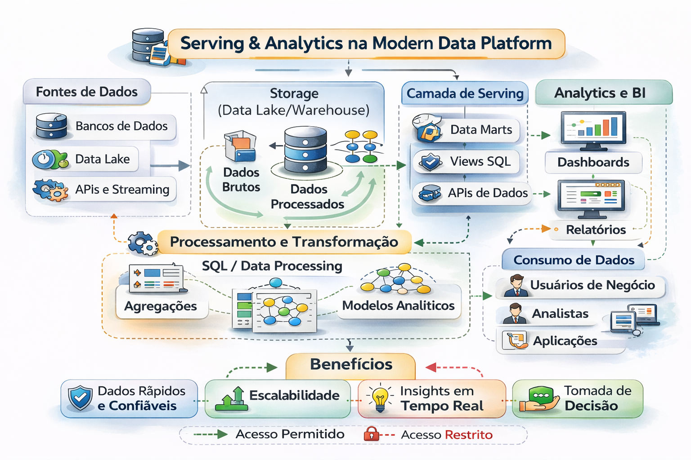

# 📊 08 - Serving & Analytics (Autoridade Executiva)

Serving é onde engenharia encontra decisão.

Aqui você aprende a construir consumo analítico **confiável, governado e financeiramente sustentável**.

Este capítulo integra:
- Serving como modelo operacional
- Camada semântica (métricas oficiais)
- BI em escala (incluindo Power BI)
- Engines de consulta (Trino/Presto, Athena, BigQuery, Snowflake)
- FinOps aplicado ao consumo analítico
- Elo executivo entre **Governança (Cap. 07)** + **FinOps** + **Serving**
- Estudos de caso (Varejo e Financeiro)

---

## 📐 Diagrama 

---

## 📂 Conteúdo

1. [Fundamentos de Serving](1-fundamentos-serving.md)  
2. [Camada Semântica como Infraestrutura](2-camada-semantica.md)  
3. [BI em Escala Corporativa (inclui Power BI)](3-bi-em-escala.md)  
4. [Engines de Consulta: o que são, como avaliar e decidir](4-engines-de-consulta.md)  
5. [Matriz Comparativa: Engines + Power BI](5-matriz-engines-powerbi.md)  
6. [Framework de Maturidade de Serving](6-framework-maturidade-serving.md)  
7. [FinOps aplicado a Serving](7-finops-serving.md)  
8. [Integração Executiva: FinOps + Governança (Cap. 07)](8-finops-governanca.md)  
9. [Estudo de Caso — Varejo](9-caso-varejo.md)  
10. [Estudo de Caso — Financeiro](10-caso-financeiro.md)

---

## 🔜 Próximo Capítulo

- [ML e IA](../9-ml-e-ia-integracao)
