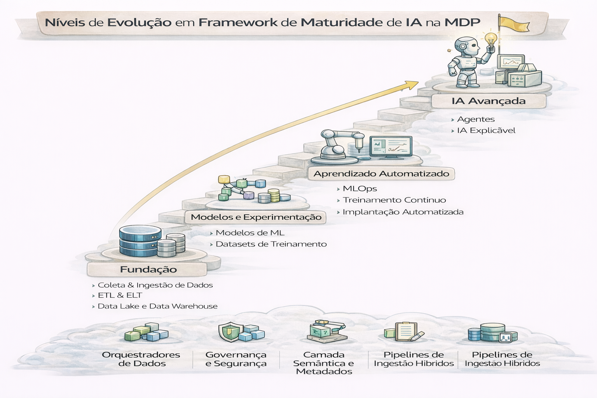

# Framework de Maturidade de IA na Plataforma

Um framework de maturidade de IA em uma Modern Data Platform (MDP) serve como um roteiro estratégico para evoluir de simples análises descritivas para sistemas autônomos e transformadores. Embora consultorias como Gartner e MIT variem nos nomes, a jornada geralmente segue estes 4 a 5 estágios fundamentais:

---

---

## Nível 1 — Experimentos
- notebooks isolados
- dados sem contrato
- sem observabilidade
- sem FinOps

## Nível 2 — Pilotos
- 1-2 modelos em produção
- monitoramento parcial
- custos pouco visíveis
- governança fraca

## Nível 3 — Operação
- registro de modelos
- pipelines de treino reprodutíveis
- monitoramento de drift
- início de FinOps (custo por modelo)

## Nível 4 — Plataforma
- feature store consolidada
- políticas de acesso e auditoria
- SLOs de inferência
- FinOps maduro (orçamento por área)

## Nível 5 — Estratégico
- IA como produto
- ROI por caso de uso
- governança forte + compliance
- custo previsível e otimização contínua

---

## Indicadores (o que medir)

- % de modelos com monitoramento ativo
- tempo médio para rollback
- incidentes de drift por mês
- custo por decisão automatizada
- inventário de modelos (com owner e risco)

---

## 🔜 Próximo

➡️ [Caso Varejo](./09-caso-varejo-ia.md)
