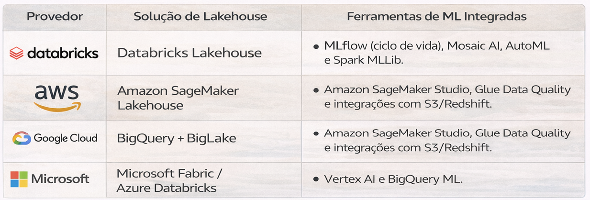

# ML no Lakehouse 

Lakehouse pode ser excelente para ML, mas só quando você entende os trade-offs.

O valor real do lakehouse para ML:

- **Histórico preservado** (time travel)
- **Dados curados + features** no mesmo lugar
- **Redução de cópias** entre ambientes
- **Governança centralizada**

---

## Por que essa arquitetura?

Implementar Machine Learning (ML) no Lakehouse significa unificar o ciclo de vida da inteligência artificial em uma única plataforma que combina a flexibilidade do data lake com o desempenho e a governança do data warehouse. Essa arquitetura elimina a necessidade de mover dados entre sistemas isolados, reduzindo custos e riscos de inconsistência. 

### Principais Benefícios para ML

- Acesso Direto a Dados Brutos e Refinados: Cientistas de dados podem acessar desde imagens e áudios (não estruturados) até tabelas Delta limpas (estruturadas) em um único repositório.

- Redução de Latência: Ao remover as camadas de ETL entre o lake e o warehouse, os modelos são treinados com os dados mais recentes disponíveis.
Confiabilidade e Governança: O uso de formatos abertos como Delta Lake, Apache 
- Iceberg ou Hudi garante transações ACID e controle de versão (time travel), essencial para a reprodutibilidade de experimentos.

- Escalabilidade Desacoplada: É possível escalar o processamento (compute) para treinamentos pesados independentemente do armazenamento.

### Principais plataformas e ferramentas

---

### Arquitetura sugerida de ML com LAKEHOUSE

O fluxo típico segue a arquitetura de medalhão:

- Bronze (Ingestão): Dados brutos são capturados (ex: via Kafka ou S3).

- Silver (Refinamento): Limpeza e engenharia de recursos (feature engineering) onde o Spark processa os dados para o formato tabular.

- Gold (Consumo/ML): Tabelas prontas para treinamento de modelos com bibliotecas como TensorFlow, PyTorch ou Scikit-learn.

### O que é errado e evitar

- “Treina direto no lake” sem controle de versões
- Feature engineering sem particionamento e sem contrato
- Tabelas com small files e metadata explosiva (impacta ML e BI)
- Time de ML criando “shadow datasets” fora da plataforma

---

## Padrão recomendado

1. Dados curados (contratos + qualidade)
2. Features materializadas (particionadas e versionadas)
3. Dataset de treino por janela (snapshot)
4. Registro do dataset de treino (para auditoria e reprodutibilidade)

---

## Perguntas de arquitetura

- Como garantimos reprodutibilidade do dataset de treino?
- Qual é a estratégia de backfill de features?
- O time consegue sustentar metadata/compaction?
- Existe SLO de disponibilidade de features?

---

## 🔜 Próximo

➡️ [LLMs & RAG Corporativo](4-llm-e-rag-corporativo.md)
