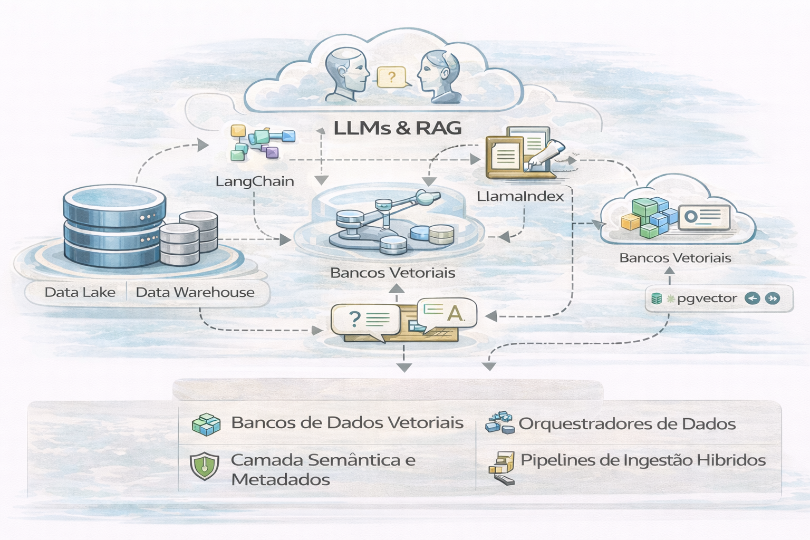

# LLMs & RAG Corporativo (arquitetura, risco e custo)

RAG corporativo é **plataforma**, não prompt.

A integração de LLMs (Large Language Models) e RAG (Retrieval-Augmented Generation) em uma Modern Data Platform (MDP) transforma o dado bruto em conhecimento acionável por meio de linguagem natural. Em vez de apenas armazenar dados, a plataforma passa a "conversar" com eles, garantindo respostas atualizadas e baseadas em fatos internos. 

---

### Componentes na Modern Data Platform

Para suportar LLMs e RAG, a arquitetura moderna evolui para incluir:

- Bancos de Dados Vetoriais: Essenciais para armazenar embeddings (representações matemáticas de significado) e realizar buscas semânticas. Exemplos incluem o Pinecone ou extensões vetoriais em bancos tradicionais como o PostgreSQL (pgvector).

- Orquestradores de Dados: Ferramentas como o LangChain e LlamaIndex conectam o fluxo entre a consulta do usuário, a recuperação do dado e a geração da resposta pelo LLM.

-Camada Semântica e Metadados: Catálogos de dados robustos permitem que o LLM entenda o contexto de tabelas, colunas e regras de negócio complexas.

- Pipelines de Ingestão Híbridos: Devem suportar tanto dados estruturados (SQL) quanto não estruturados (PDFs, logs, imagens) para alimentar o contexto do RAG. 

### O Papel do RAG na Plataforma

O RAG resolve as principais limitações dos LLMs "puros" dentro das empresas: 

- 1-Atualização em Tempo Real: Conecta o modelo a bases de dados vivas sem a necessidade de re-treinamento (fine-tuning) caro e lento.

- 2-Redução de Alucinações: O modelo é forçado a responder com base em documentos recuperados, citando fontes para auditoria.

- 3-Segurança e Governança: Permite restringir o acesso à informação com base nos níveis de autorização do usuário na própria plataforma de dados.

### Plataformas de Mercado com Suporte Nativo

Grandes provedores já integram essas capacidades em seus ecossistemas: 

- Databricks: Utiliza o Mosaic AI para gerenciar pipelines RAG ponta a ponta.

- Snowflake: Oferece o Cortex AI para processamento de LLMs diretamente sobre os dados governados.

- Google Cloud: Combina o Vertex AI com o AlloyDB para buscas vetoriais de alta performance.

- Microsoft Azure: Integra o Azure AI Search com serviços OpenAI para fluxos agenticos. 

---

Uma arquitetura madura responde 3 perguntas:

1. **Que dado o modelo pode ver?** (Governança)
2. **Quanto custa responder?** (FinOps)
3. **Como auditar o que aconteceu?** (Risco/Compliance)

---

## Fluxo arquitetural recomendado

1. Curadoria e classificação das fontes
2. Indexação vetorial com versionamento
3. Recuperação com filtros de permissão (policy)
4. Prompt assembly controlado
5. Observabilidade: qualidade, latência, custo, auditoria

---

## Riscos que líderes precisam entender

- **Vazamento**: o modelo “vê” o que não deveria
- **Alucinação**: resposta convincente e errada
- **Custo**: crescimento de uso sem orçamento
- **Shadow AI**: times criando RAG fora da governança

---

## Boas práticas que impressionam (porque quase ninguém faz)

- Versionar embeddings e índices
- Logar prompts/recuperação (com redaction quando necessário)
- Medir taxa de “resposta sem evidência”
- Controlar custo por área/assistente (FinOps)
- Aplicar RLS/CLS também no contexto recuperado

---

## 🔜 Próximo

➡️ [Governança em IA](5-governanca-em-ia.md)
