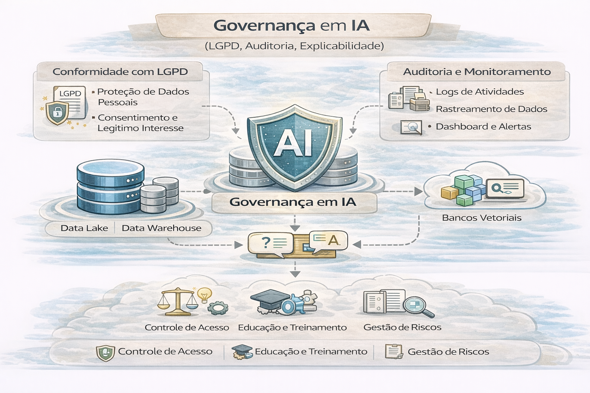

# Governança em IA (LGPD, auditoria, explicabilidade)

IA amplia risco regulatório e reputacional.

A governança em Inteligência Artificial (IA) no Brasil em 2026 é estruturada pelo cumprimento da Lei Geral de Proteção de Dados (LGPD), pela evolução do PL 2338/2023 (Marco Legal da IA) e pelas diretrizes da Autoridade Nacional de Proteção de Dados (ANPD). 

---

### 1. LGPD e Decisões Automatizadas 

A LGPD exige transparência e garante direitos fundamentais aos titulares de dados cujas informações são processadas por IA: 

- Direito à Revisão: O Artigo 20 permite que o titular solicite a revisão de decisões tomadas unicamente com base em tratamento automatizado que afetem seus interesses.

- Transparência e Finalidade: As empresas devem informar claramente a finalidade da coleta de dados para o treinamento de modelos, respeitando o princípio da necessidade.

- Relatório de Impacto (RIPD): É obrigatório em cenários de alto risco para analisar riscos aos titulares e medidas mitigadoras. 

### 2. Explicabilidade (Explainability)

Refere-se à capacidade de tornar compreensível o "porquê" de um modelo de IA ter chegado a um resultado específico: 

- Direito à Explicação: A LGPD disciplina o fornecimento de informações claras sobre os critérios e procedimentos utilizados na decisão automatizada.

- Desafio da Caixa-Preta: Modelos complexos (como redes neurais profundas) dificultam a interpretação técnica, exigindo o uso de técnicas interpretáveis ou mecanismos de explicação pós-hoc.

- Segredo Comercial: O controlador pode recusar fornecer detalhes técnicos se houver risco ao segredo industrial, mas a ANPD pode realizar auditorias para verificar se houve discriminação. 

### 3. Auditoria Algorítmica

Processo de avaliação independente para garantir que o sistema de IA opere de forma ética, segura e sem vieses:

- Escopo: Avalia desde a formulação dos dados de treinamento até os impactos em termos de justiça algorítmica, privacidade e segurança.

- Papel do Compliance: Atua na fiscalização das decisões para garantir que não ocorram prejuízos discriminatórios, especialmente em modelos de IA generativa.

- Linhas de Defesa: A auditoria interna deve validar soluções de IA, mantendo expertise para monitorar anomalias e inconsistências em tempo real. 

### Principais Pilares da Governança 

- Avaliação de Risco: Identificação proativa de riscos éticos e jurídicos antes da implantação.

- Transparência: Comunicação clara sobre a origem dos dados e a lógica do algoritmo.

- Responsabilidade: Definição de quem responde por erros ou danos causados pela "pessoa cibernética".

- Human-in-the-loop: Manutenção de supervisão human

---

Governança em IA não é opcional quando há:
- dados sensíveis
- decisões automatizadas
- impacto financeiro/cliente

---

## Pilares de governança em IA

1. **Classificação de dados**
   - sensível / regulado / interno
2. **Política de acesso**
   - quem pode treinar? quem pode inferir?
3. **Auditoria**
   - logs de decisão automatizada
4. **Explicabilidade**
   - quais features influenciaram?
5. **Risco e aprovação**
   - modelos críticos precisam de “change management”

---

## Anti-pattern (perigoso)

“Modelo em produção porque bateu 0.92 de AUC.”

Sem governança:
- você não prova por que decidiu
- você não prova o que o modelo viu
- você não controla impacto

---

## Perguntas executivas

- Conseguimos explicar decisões automatizadas?
- Conseguimos revogar acesso rapidamente?
- Conseguimos auditar uso de dados sensíveis?
- Existe inventário de modelos e seus donos?

---

## 🔜 Próximo

➡️ [MLOps + Observabilidade](6-mlops-e-observabilidade.md)
