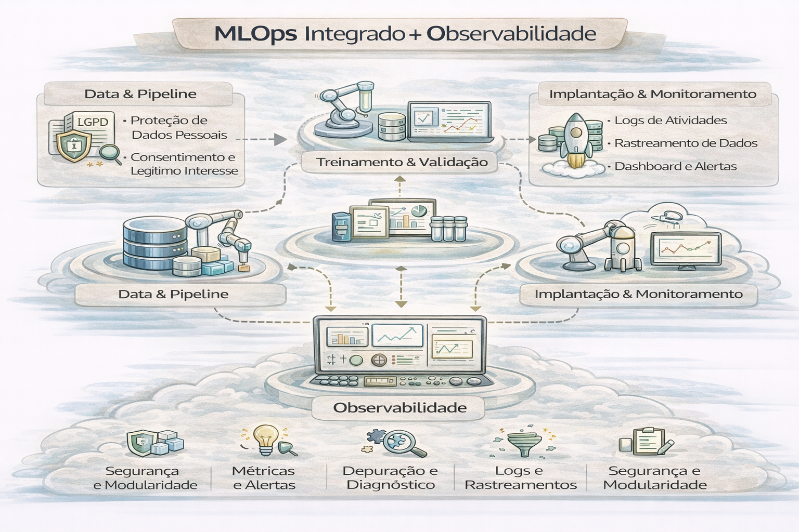

# MLOps Integrado + Observabilidade

MLOps não é “deploy de modelo”. É **operação contínua**.

A integração de MLOps (Machine Learning Operations) com observabilidade é uma abordagem fundamental para garantir que modelos de IA saiam da fase experimental e funcionem de forma confiável, segura e escalável em produção. Enquanto o MLOps automatiza o ciclo de vida do modelo, a observabilidade oferece a visibilidade necessária para detectar falhas, desvios (drift) e degradação de desempenho 
em tempo real. 

---

### O que é MLOps Integrado + Observabilidade?

- MLOps Integrado: Envolve a automação de todas as etapas (pipelines) — coleta de dados, treinamento, validação, deploy e monitoramento — conectando ciência de dados com engenharia de software e operações.

- Observabilidade no ML: Vai além do monitoramento simples de infraestrutura (CPU/Memória). Ela rastreia a saúde do modelo, a qualidade dos dados de entrada (input drift), o comportamento das previsões (output drift) e a precisão do modelo ao longo do tempo. 

### Pilares da Observabilidade em MLOps

Para um MLOps eficaz, a observabilidade deve monitorar três áreas principais: 

- Dados (Data Drift): Identificar se os dados que o modelo recebe em produção são diferentes dos dados usados no treinamento.

- Modelo (Concept Drift): Detectar se a relação entre as variáveis de entrada e a previsão do modelo mudou, tornando-o impreciso.

- Infraestrutura e Performance: Monitorar latência, taxas de erro e consumo de recursos. 

### Benefícios da Integração

- Redução de Falhas: A observabilidade contínua é crucial para evitar falhas de modelos em produção, um dos principais riscos operacionais segundo a Gartner.
- Retreinamento Automatizado: A detecção de drift pode acionar automaticamente pipelines de "Continuous Training" (CT), ajustando o modelo sem intervenção manual.

- Melhor Rastreabilidade: Permite correlacionar comportamentos do modelo com versões específicas de dados e código, facilitando a análise de causa raiz.

Ferramentas para MLOps e Observabilidade

- Plataformas de ML: Databricks, AWS SageMaker, Google Cloud Vertex AI, Azure Machine Learning.

- Observabilidade Especializada: Fiddler AI (IA explicável), Arize AI, Evidently AI.

- Monitoramento/Orquestração: Prometheus e Grafana (dashboards de métricas), Apache Airflow, Kubeflow, MLflow. 

### Boas Práticas

- Rastreamento (Tracking): Utilize ferramentas como MLflow para registrar todos os experimentos, hiperparâmetros e artefatos.

- Alerta Automatizado: Configure alertas não apenas para erro de sistema, mas também para desvios estatísticos na performance do modelo.

- Entenda o "Porquê": Implemente técnicas de explicabilidade (explainability) para entender por que um modelo tomou uma decisão específica quando uma anomalia for detectada. 

A ausência de um monitoramento contínuo bem integrado pode levar a modelos que, apesar de precisos no treinamento, se tornam ineficazes no mundo real.

---

## Ciclo sustentável

Treino → Validação → Deploy → Monitoramento → Feedback → Re-treino

---

## O que monitorar (de verdade)

### 1) Drift de dados
- distribuição mudou?
- missing aumentou?
- cardinalidade mudou?

### 2) Drift de modelo
- performance degradou?
- taxa de erro aumentou?
- thresholds ficaram defasados?

### 3) Saúde operacional
- latência
- disponibilidade
- fila / backlog
- erros por versão

### 4) Impacto e segurança
- decisões anômalas
- outliers críticos
- acesso indevido

---

## SLOs recomendados

- Latência P95 de inferência
- Disponibilidade do endpoint
- Tempo máximo para detectar drift
- Tempo máximo para rollback

---

## 🔜 Próximo

➡️ [FinOps para ML & IA](7-finops-ml-ia.md)
