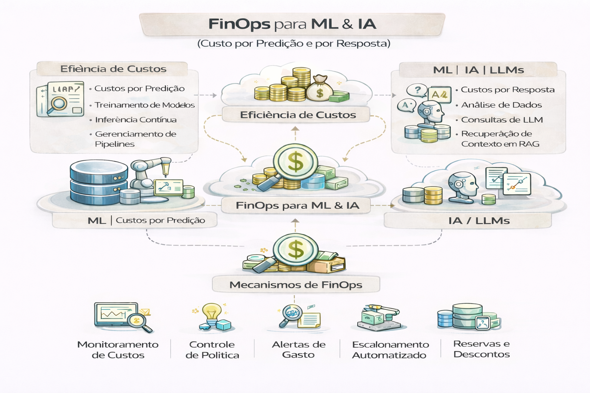

# FinOps para ML & IA (custo por predição e por resposta)

FinOps em IA é onde muita empresa “perde o controle” sem perceber.

A regra é simples:
**se você não mede custo por decisão, você não controla custo.**

FinOps para ML e IA foca em transformar custos variáveis e complexos (como GPUs e tokens) em métricas de valor de negócio, utilizando as fases de Informar, Otimizar e Operar. A unidade fundamental para medir a eficiência nessas cargas de trabalho é a Unit Economics, que permite calcular o custo real por cada entrega do modelo. 

---

### 1. Custo por Predição (Machine Learning Tradicional)

Em modelos de ML clássicos (regressão, classificação), o custo é geralmente impulsionado pela infraestrutura de infraestrutura (CPU/GPU) e pelo tempo de execução. 

- Custo por Predição = Custo de Infra + Custo de dados / Numero de Predições

- Métricas de Controle:
Utilização de GPU: Monitorar se a GPU está ligada sem carga proporcional.
Alocação por Projeto: Usar tags e metadados para separar custos de desenvolvimento de custos de produção.

- Right-sizing: Ajustar o tamanho das instâncias de inferência para evitar desperdício de recursos ociosos. 

### 2. Custo por Resposta (IA Generativa / LLMs)

Para IA Generativa, o custo é baseado no consumo de tokens, onde as entradas (prompts) e saídas (respostas) têm preços distintos, sendo a saída geralmente 3x a 5x mais cara. 

- Custo por Resposta = (Tokens de Entrada x Taxas In) + (Tokens de Saída x Taxa Out)

### Fatores de Variação:

- Histórico da Conversa: Em chats multi-turno, o custo de cada nova resposta aumenta porque todo o contexto anterior é reenviado como entrada.

- Latência vs. Custo: Modelos maiores (como GPT-4) custam significativamente mais por resposta do que modelos menores ou destilados.

### Estratégias de Otimização:

- Prompt Routing: Direcionar solicitações simples para modelos mais baratos.

- Prompt Caching: Armazenar respostas para prompts frequentes, reduzindo o processamento de tokens repetidos em até 70%.

- Token Budgeting: Definir limites máximos de tokens por usuário ou funcionalidade para evitar estouros de orçamento.

### Resumo Comparativo

- Custo por Predição: Infraestrutura (Instance/GPU/TPU)	Escalabilidade automática e instâncias spot.
- Custo por Resposta: Tokens (Input/Output)	Prompt engineering, caching e escolha de modelo.

---

## Onde o custo aparece

### Treinamento
- compute (GPU/CPU)
- armazenamento de datasets
- experimentos repetidos

### Inferência (online/batch)
- custo por chamada
- pico de concorrência
- latência exigida

### RAG/LLM
- custo por token
- custo de embeddings/indexação
- custo de recuperação + geração
- custo de logs e auditoria

---

## Modelo prático de gestão

1. **Visibilidade**
   - custo por modelo
   - custo por endpoint
   - custo por área (centro de custo)
2. **Orçamento**
   - limites por time/produto
3. **Otimização**
   - cache de respostas
   - compressão de contexto
   - top-k e filtros melhores
4. **Políticas**
   - uso permitido vs proibido
   - “gates” para modelos caros

---

## Métricas que impressionam liderança

- Custo por predição
- Custo por 1.000 respostas (RAG)
- Custo por usuário ativo
- % de chamadas com “valor” (ex.: resolução real)
- Custo de auditoria por decisão automatizada

---

## 🔜 Próximo

➡️ [Framework de Maturidade de IA](8-framework-maturidade-ia.md)
