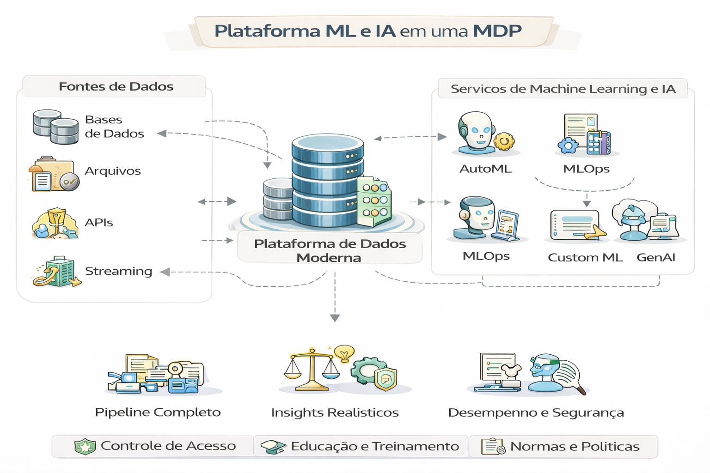

# 🤖 9 - ML & IA Integrados à Plataforma de Dados (Enterprise)

Este capítulo é para quem quer **construir plataforma**, não “rodar modelo”.

Aqui você aprende a integrar ML e IA Generativa com:
- Contratos e qualidade de dados
- Feature Store e reprodutibilidade
- Governança (risco, auditoria, acesso)
- FinOps (custo de treino, inferência e RAG)
- Observabilidade (drift, SLO, incidentes)

---

## Plataforma ML e IA em uma MDP

A integração de Machine Learning (ML) e Inteligência Artificial (IA) em uma Modern Data Platform (MDP) transforma a infraestrutura de dados de um simples repositório em um ecossistema inteligente capaz de gerar previsões e automações em tempo real. 

Diferente das arquiteturas legadas, a plataforma moderna é desenhada para ser o "esqueleto" que sustenta modelos de IA, fornecendo dados limpos, escalabilidade em nuvem e governança automatizada. 

### Estrutura da Integração (Arquitetura)
Uma plataforma de dados moderna pronta para IA geralmente é composta por camadas modulares: 

- Ingestão e Armazenamento: Uso de Data Lakes ou Lakehouses (como Databricks) para armazenar dados estruturados e não estruturados, essenciais para o treinamento de modelos.

- Processamento e Transformação: Ferramentas como o dbt automatizam a preparação dos dados, garantindo que a IA receba informações higienizadas e confiáveis.

- MLOps (Operações de ML): Camada que gerencia o ciclo de vida dos modelos (treinamento, implantação e monitoramento), permitindo escalar a IA de forma eficiente.

- Serviços de IA Generativa: Integração com plataformas como o Amazon Bedrock ou Azure AI para acessar modelos fundacionais (LLMs) diretamente sobre a base de dados da empresa.

### Benefícios Estratégicos

- Self-Service Analytics: A IA permite que usuários de negócios façam perguntas aos dados em linguagem natural (ex: via Zoho Analytics ou Tableau) sem precisar de SQL.

- Detecção de Padrões e Fraudes: Modelos de ML processam volumes massivos de dados financeiros em tempo real para identificar anomalias.

- Personalização em Escala: Otimização da experiência do usuário em e-commerce e streaming através de recomendações preditivas baseadas no histórico de dados.

- Eficiência Operacional: Automação da limpeza e governança de dados, reduzindo o esforço manual e erros humanos

---

## 📐 Diagramas 

1. **ML Integrado End-to-End**  
   

2. **RAG Corporativo com Governança + FinOps**  
   

3. **Feature Store: Treino vs Produção**  
   

---

## 📂 Conteúdo

1. [Arquitetura de ML na Plataforma](1-arquitetura-ml-na-plataforma.md)  
2. [Feature Store (de verdade)](2-feature-store.md)  
3. [ML no Lakehouse (sem hype)](3-ml-no-lakehouse.md)  
4. [LLMs & RAG Corporativo (arquitetura, risco e custo)](4-llm-e-rag-corporativo.md)  
5. [Governança em IA (LGPD, auditoria, explicabilidade)](5-governanca-em-ia.md)  
6. [MLOps Integrado + Observabilidade](6-mlops-e-observabilidade.md)  
7. [FinOps para ML & IA (custo por predição e por resposta)](7-finops-ml-ia.md)  
8. [Framework de Maturidade de IA na Plataforma](8-framework-maturidade-ia.md)  
9. [Estudo de Caso — Varejo](9-caso-varejo-ia.md)  
10. [Estudo de Caso — Financeiro](10-caso-financeiro-ia.md)

---

## 🔜 Próximo Capítulo

- [Observabilidade e Finops](../10-observabilidade-finops)
