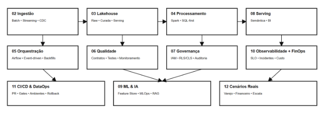

# Modern Data Platform & Engenharia de Dados
### Arquitetura • Lakehouse • Governança • ML • GenAI • FinOps • DataOps

---

## 🎯 O que é este repositório

Este não é um repositório de ferramentas.

É um **blueprint completo para construir e escalar uma Modern Data Platform**, cobrindo:

- Arquitetura de dados
- Estratégias de ingestão
- Modelagem Lakehouse
- Engines de processamento
- Orquestração
- Qualidade de dados
- Governança & segurança
- Serving & camada semântica
- Machine Learning integrado
- GenAI & RAG corporativo
- Observabilidade & SLOs
- FinOps aplicado a dados
- CI/CD & maturidade DataOps
- Cenários reais de aplicação

Construído para profissionais que querem pensar além de pipelines.

---

# 🏛️ Filosofia de Plataforma

Modern Data Platform =

Arquitetura  
+ Governança  
+ Confiabilidade  
+ Sustentabilidade financeira  
+ Prontidão para IA  

Ferramentas mudam.  
Princípios escalam.

---

# 📁 Estrutura do Repositório

## [0-Visão de Plataforma](0-visao-plataforma)

- Definição de Modern Data Platform
- Mentalidade projeto vs mentalidade plataforma
- Por que pipelines quebram mesmo com “as ferramentas certas”

---

## [1-Arquitetura](1-arquitetura)

- Arquitetura de referência
- Blueprint AWS Lakehouse
- Blueprint GCP
- Trade-offs reais
- Anti-patterns

---

## [2-Ingestão](2-ingestao)

- Batch vs Streaming
- CDC
- Event-driven ingestion
- Evolução de schema

---

## [3-Storage e Lakehouse](3-storage-lakehouse)

- Iceberg em profundidade
- Design de tabelas
- Particionamento
- Small files
- Metadata explosion
- Time travel

---

## [4-Processamento](4-processamento)

- Quando usar (e não usar) Spark
- DuckDB & Polars
- SQL-first platforms
- Trade-offs de engine

---

## [5-Orquestração](5-orquestracao)

- Airflow em produção
- Design de DAG
- Idempotência
- Retries
- Backfills

---

## [6-Qualidade de Dados](6-qualidade-de-dados)

- Contratos de dados
- Expectations
- Monitoramento
- Cultura de confiabilidade

---

## [7-Governança e Segurança](7-governanca-e-seguranca)

- IAM
- Segurança por linha e coluna
- Auditoria
- Compliance

---

## [8-Servindo Analytics](8-servindo-analytics)

- Presto / Trino / Athena
- Power BI em escala
- Modelagem semântica
- Custo vs performance
- Maturidade de serving

---

## [9-ML e IA](9-ml-e-ia-integracao)

- Arquitetura de ML integrada
- Feature Store
- MLOps
- RAG corporativo
- Governança em IA
- FinOps para IA

---

## [10-Observabilidade e Finops](10-observabilidade-finops)

- SLOs & SLAs
- Error budget
- Incidentes
- KPIs executivos
- Sustentabilidade de plataforma

---

## [11-CI/CD e DataOPs](11-ci-cd-dataops)

- PR e revisão
- Gates de qualidade
- Ambientes (DEV → STG → PROD)
- Rollback
- GitHub Actions
- Versionamento

---

## [12-Cenários Reais](12-cenarios-reais)

- Varejo end-to-end
- Plataforma regulada financeira
- Escala 100x
- Checklist executivo

  
---

# 📊 Fluxo Conceitual

Ingestão  
→ Lakehouse  
→ Processamento  
→ Serving  
→ ML & IA  
→ Governança  
→ Observabilidade  
→ FinOps  
→ CI/CD  
→ Plataforma Sustentável  

Tudo está conectado.

---

# 🧠 Para quem é esse repositório

- Engenheiros de Dados (Senior/Staff)
- Arquitetos
- Analytics Engineers
- Líderes técnicos
- Heads of Data / CDOs
- Profissionais que querem sair do nível executor para designer de plataforma

---

# 🔎 O que você vai encontrar aqui:

Modern Data Platform  
Arquitetura de Dados  
Lakehouse  
Apache Iceberg  
Data Governance  
Data Observability  
FinOps para Dados  
MLOps  
Feature Store  
RAG Corporativo  
CI/CD para Dados  
DataOps  
Power BI / Business Intelligence em escala  

---

# 📌 Conclusão

Se você quer entender melhor sobre:

- Governança clara
- SLO definidos
- Controle de custos
- Estratégia de rollback
- Integração com IA

Encontrará nesse repositório, seja para estudar ou aplicar.

---

## Autor - Fabio Marçolia | Carreira em Dados & IA

Para mais conteúdo de Python, Carreira em Dados e IA, ou se quiser falar comigo sobre dúvidas, sugestões ou feedback:

- Linkedin: [Vamos nos conectar e me envie uma mensagem🤝](http://linkedin.com/in/fabiomarcolia)
- Mais Recursos de Carreira: [Veja aqui](https://topmate.io/fabiomarcolia)

Agradeço seu apoio e fique a vontade de entrar em contato comigo!
